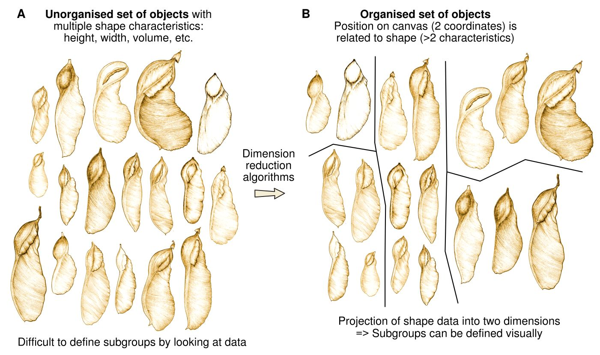
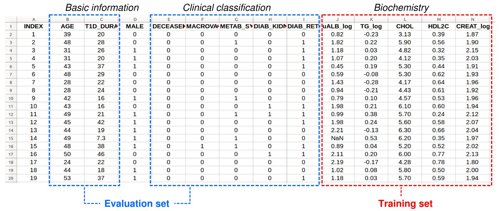
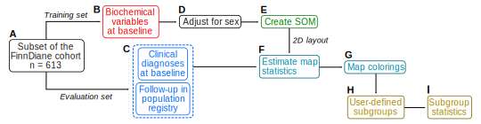
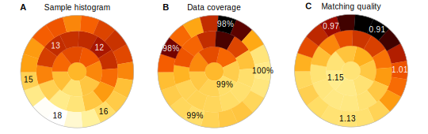
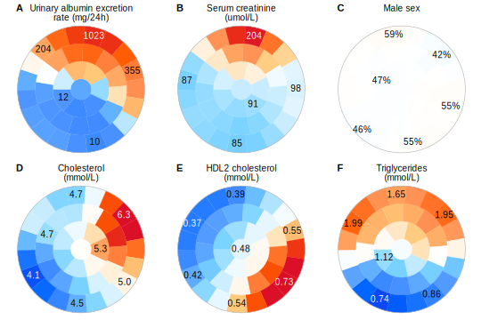
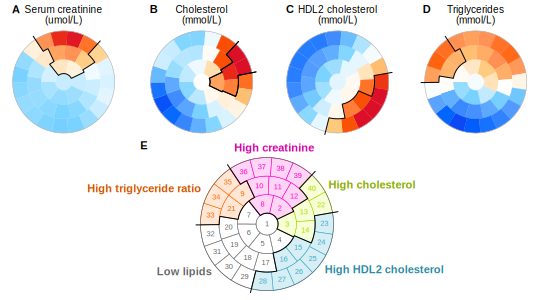
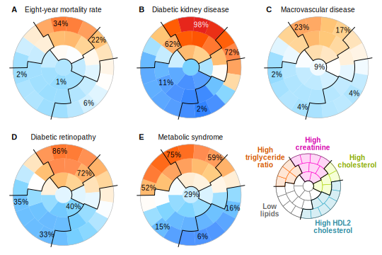

```{r setUpLibrary, eval=TRUE, include=FALSE}
library(Numero)

figRef <- local({
    tag <- numeric()
    created <- logical()
    used <- logical()
    function(label, caption, prefix = options("figcap.prefix"), 
        sep = options("figcap.sep"), prefix.highlight = options("figcap.prefix.highlight")) {
        i <- which(names(tag) == label)
        if (length(i) == 0) {
            i <- length(tag) + 1
            tag <<- c(tag, i)
            names(tag)[length(tag)] <<- label
            used <<- c(used, FALSE)
            names(used)[length(used)] <<- label
            created <<- c(created, FALSE)
            names(created)[length(created)] <<- label
        }
        if (!missing(caption)) {
            created[label] <<- TRUE
            paste0(prefix.highlight, prefix, " ", i, sep, prefix.highlight, 
                " ", caption)
        } else {
            used[label] <<- TRUE
            paste(prefix, tag[label])
        }
    }
})
options(figcap.prefix = "Figure", figcap.sep = ":", figcap.prefix.highlight = "**")
```

# Introduction

Pattern recognition and clustering algorithms are the methodological cornerstones of the “big data” paradigm. In biology, high-throughput genomics and detailed imaging techniques are applied avidly to learn the details of how cells work and how diseases develop, and big datasets are expanding at an exponential rate, which also means that biomedical data analysis relies more and more on computational modeling and visualization in addition to the traditional descriptive statistics. The taxonomic tradition in biomedicine to categorize phenomena into distinct easily identifiable boxes remains strong, which explains the popularity of classical algorithms such as principal component analysis and hierarchical clustering as the first and often only choices for visualization and interpretation of the multi-dimensional structure of a complex dataset. However, both methods struggle when the dataset resembles a continuum instead of distinct clusters of data.

In the vignette, we focus on biomedical applications of the *Numero* framework. Although we have previously used the framework for metabolomics and biomedical data analysis, the functionality is not restricted to biological applications, but the method can also be applied to any complex dataset. The choice of diabetic kidney disease as an example reflects our experience in the field, whereas Numero itself can be applied to any analysis problem that involves complex multi-dimensional data.

The document is organized into sections and paragraphs that describe our motivation for developing the library, introduce the concept of the self-organizing map, describe the dataset we use as an example of a biomedical study, go through a complete *R*-script of an analysis pipeline, define metabolic subgroups, interpret the results and discuss the role of the map analyses in publications. 

## Limitations of conventional categorization

The conventional notion of qualitative data patterns (e.g. health vs. disease) fits well with clustering algorithms that aim to find discriminatory borders automatically within the data. However, we argue that many biomedical datasets do not have identifiable clusters, but they instead reflect a multivariable spectrum of causes and consequences where the borderline between health and disease is blurred. For instance, chronic kidney disease is defined according to an internationally accepted threshold of glomerular filtration rate (GFR < 60 mL/min 1.73 m^2^, [@levey2012chronic]), but there is no mathematically identifiable threshold effect in the population-based GFR distribution or any other biomarker or physical characteristic, as demonstrated by the continuous discussion on diagnostic criteria [@delanaye2012]. Therefore, in most cases it is impossible to say exactly when someone develops chronic kidney disease, only that the diagnostic threshold is reached after a gradual decline, after which treatments can be initiated according to consensus guidelines.

Typical clustering analyses rely on algorithms that are tweaked for different application domains to produce classifications that are mathematically optimal, to reproduce an existing gold standard, or to predict future outcomes. We maintain that excessive reliance on mathematical criteria is not useful for datasets without intrinsic clustering structure, since the choice of the criteria will determine the output rather than the data or practical usefulness of the classification. Furthermore, the process that leads to category assignments is often too complicated to understand on a practical level, so the human observer must rely on the algorithmic “black box” to produce the classification results without access to the inner workings. We propose a half-way solution, where the aim is to simplify the data presentation with statistical verification so that a human observer can determine a suitable subgrouping for a specific purpose, yet with sufficient access to the data patterns to understand the characteristics of the dataset in detail.

A traditional strict classification model will work well if measurable qualitative differences exist. For instance, type 1 diabetes is an autoimmune form of diabetes that develops in children and adolescents. The condition is severe with a short life expectancy, if untreated, so type 1 diabetes can be considered a qualitative example of health versus disease. Consequently, highly accurate diagnostic biomarkers such as glucose, insulin and C-peptide already exist. Even when treated, type 1 diabetes has a profound long-term impact on energy metabolism and it represents a distinct biomedical data cluster that is separate from the non-diabetic population.

Unlike type 1 diabetes, common age-associated diseases such as chronic kidney disease, type 2 diabetes, and atherosclerosis are challenging from a clustering perspective: they take decades to develop, they are not immediately life-threatening if left untreated, and there is a wide variation in severity across individuals. Furthermore, the affected individuals often suffer from multiple interacting chronic conditions, making it difficult to isolate specific causes and symptoms. Therefore, the simplistic notion of a qualitative threshold between health and disease becomes problematic. We aim to address these challenges by creating subgroups that are of practical value beyond mathematical criteria, and guided by a human observer with access to understandable presentations of the multivariable data patterns.

Multiple co-occurring and inter-connected phenomena are hallmarks of complex systems and the observable data that can be obtained from them. This presents a challenge to the traditional paradigms of biomedicine. For instance, differential diagnostics cannot cope well with multiple overlapping diseases, or evolving degrees of severity. This motivated us to develop the *Numero* framework in such a way as to enable visual comparisons of multiple overlapping diagnoses and their diagnostic criteria. We expect the *Numero* framework to be highly valuable in situations where the most important outcome or a set of outcomes is not obvious (e.g. competing risk scenarios). For instance, patients with type 1 diabetes may develop serious injuries to their vasculature over decades, but the affected organs, severity and rate of progression vary. Therefore, predictive models that focus only on a single outcome at a time may miss the big picture. The example of diabetic kidney disease we use in this vignette demonstrates how to use the *Numero* framework to gain insight into the overlaps and longitudinal associations between multiple morbidities.

## Self-organizing map

Expressing multivariable data in visual form is a critical part of any knowledge discovery process, and an extensive number of algorithms have been developed in recent decades. In many cases, the aim is to project a set of multivariable data points into a two-dimensional presentation for human viewing ([Figure 1](#fig:legumes)). We built the*Numero* package using the self-organizing map (SOM) algorithm [@kohonen2001], which is based on only a few simple mathematical rules, does not break down due to missing data and can handle a high number of variables. We also developed a method to estimate the statistical significance of the map patterns [@makinen_1h2008]. Of note, the modular structure of the library allows users to replace the SOM with any other suitable algorithm for customized analysis pipelines.

<a id="fig:legumes"></a>
```{r legumes, eval=TRUE, echo=FALSE, fig.cap="A conceptual example of data-driven subgrouping. The example shows how to organize objects with multiple features into a two-dimensional layout. The images were obtained from @cardoso2014taxonomic."}

```

Conceptually, the SOM algorithm mimics a human observer who wants to make sense of a set of objects. For instance, [Figure 1A](#fig:legumes) depicts schematic drawings of the flowering legume genus Luetzelburgia that grows in South America [@cardoso2014taxonomic]. [Figure 1B](#fig:legumes) shows how a human observer might organize the drawings based on their visual similarities (shape, size and other morphological details). By organization, we refer to the spatial layout of the drawings on the two-dimensional canvas: drawings that look similar are close to each other, whereas drawings that look different are far apart (in most cases). This is how all people, from children to elderly, sort and classify their objects with multiple observable features (= multivariable data points) with the help of a two-dimensional surface (= data map). The same observer then decides how to split the dataset into subgroups based on his or her domain knowledge.

If there are thousands of drawings, manual organization becomes impractical. For this reason, we let the SOM algorithm to do the first organization step, and to visualize the salient patterns within the dataset in a two-dimensional data map. The spatial principle still applies: multivariable data points that have similar values are close to each other, whereas data points that are different are on the opposite sides of the map. The second step of defining subgroups remains the responsibility of the observer. We argue that this type of data-assisted subgrouping is particularly useful in situations where there is no qualitative threshold between health and disease, but a line must be drawn to initiate preventative measures or treatments.

Although there are only 18 drawings in [Figure 1](#fig:legumes), the nature of the dataset resembles many epidemiological studies. Specifically, some of the drawings are very similar, but it is not obvious how they should be classified into subgroups (i.e. our version of the figure can be disputed, a single “correct” visual subgrouping may not exist). If the classification was based on the height of a drawing, the results would look different compared to using the width – some drawings are narrow while being long, whereas others are wide despite being short. This is a naïve example on how the selection of the mathematical criteria for classification has a substantial impact on the results, and illustrates the motivation for our work. We developed the *Numero* library as an alternative tool that helps researchers to define meaningful groupings when pure mathematics cannot provide a conclusive answer.

Previous versions of the software (written for Matlab) were successfully used on a range of metabolomics and other biomedical studies [@bernardi2010; @kumpula2010; @kuusisto2012; @makinen_1h2008; @makinen_metabolic_2008; @tukiainen2008; @wurtz2011; @makinen2013]. However, the old version used a rectangular SOM, which tends to guide observers into picking four subgroups in the corners even when not supported by data. We created the *Numero* package with a circular implementation of the SOM to remove the limitations from cornered border shapes. Additional technical details and supportive material are available as an online supplement within a previous publication [@makinen2012].

# Terminology

**Data point** – Here, we define the term data point as a single uniquely identifiable row in a spreadsheet of data (with variables as columns). For instance, in the diabetic kidney disease dataset described in the next section, a data point refers to a patient (and vice versa) as there is only one row per patient.

**Map** – A map is a general term to describe the two-dimensional canvas onto which the multivariable data points are projected. The concept is analogous to a geographic map that indicates where people live, except that the location is not based on geography (i.e. physical distances), but comes from the data (i.e. distances = data-based similarities).

**Layout** – We make a distinction between what is a map, and what is the layout of the data points on it. The layout is a table of data point locations as coordinates, whereas the map is a more integrated concept that also includes information that is necessary to find the locations of new previously unseen data points, and to draw and paint the map in visual form.

**District** – A district refers to a pre-defined division of the map into uniformly sized areas. The districts are created mainly for technical reasons: using districts speeds up calculations and enables the estimation of map-related statistics. This is analogous to a real city being divided into districts to estimate regional demographics, for instance.

**Coloring** – The Numero framework always creates a single map. However, the map districts can be painted with different colors. This enables the user to create multiple colorings of the map to visualize regional differences. These colorings can be made for each variable, which helps to identify which parts of the map are particularly important for a specific phenomenon. Again, this is similar to a real city map where the districts are colored according to the income level of the local residents, or according to the mean age, smoking rates, obesity etc.

**Subgroup** – We expect that most uses of Numero will result in the subgrouping of a complex dataset. Visually, we define a subgroup via a contiguous set of adjacent districts on the map. Consequently, all the data points that are located within the set of districts are the subgroup members.

**District profile** – The SOM algorithm works through the districts during the optimization of the data point layout on the map. The computational process eventually converges to a stable configuration that is stored as a set of district profiles. From a practical point of view, a district profile represents the typical average profile that captures the characteristics of the data points within the district. In technical terms, the district profile (also known as the prototype) contains the mean weighted data values across all the data points, where the weights are determined by the neighborhood function used in the SOM algorithm.

**Best-matching district** – The best-matching district (BMD, also known as the best-matching unit in the literature) is the district with a profile that is the most similar to a data point when considering all variables simultaneously. The BMD is closely related to the data point layout: the assigned location for a data point is the location of the BMD for that data point.

# Example dataset of diabetic kidney disease

Diabetic kidney disease is the leading indication for dialysis and kidney transplantation in the developed countries, and carries a substantial risk of premature death due to cardiovascular disease. About one third of individuals with type 1 diabetes will develop diabetic kidney disease during their lifetime. As the typical age of onset of type 1 diabetes is in childhood or adolescence, these individuals will develop complications at a relatively early age. Therefore, people with type 1 diabetes represent a particularly vulnerable group facing lower quality of life and reduced life span due to kidney damage.

Albuminuria (elevated albumin concentration in urine) is the basis for the clinical classification of diabetic kidney disease. In this example, we applied the threshold of 300mg/24h, if 24h urine collections were done and 0.2 mg/min when overnight urine data were available from the local medical centers that examined the patients. If the threshold was exceeded in at least two out of three consecutive measurements, we assigned the individual in the diabetic kidney disease group. In addition, the FinnDiane Study Group measured urinary albumin excretion rate from a single 24h urine sample in their designated central laboratory. The logarithm of the albumin excretion rate was included in the example dataset.

Our example dataset contains a subset of data from a previous publication [@makinen_1h2008]. We created the simplified dataset for educational purposes, but it contains enough information to replicate some of the findings from the original study. The dataset includes `r nrow(nroMatrix(system.file("extdata", "finndiane_dataset.txt", package = "Numero"), keyvars = "INDEX"))` individuals of whom `r length(which(nroMatrix(system.file("extdata", "finndiane_dataset.txt", package = "Numero"), keyvars = "INDEX")[,"DIAB_KIDNEY"] == 1))` individuals had diabetic kidney disease at baseline. In addition, we included information on whether an individual had died after an eight-year follow-up to demonstrate how the study design we chose can be applied to longitudinal data. The available data are summarized in [Table 1](#tab:summary).

<a id="tab:summary"></a>

Trait                              | No kidney disease | Diabetic kidney disease | P-value
---------------------------------- | ----------------- | -------------- | --------------------------
Men / Women                        |     192 / 196     |     119 / 106            | 0.45
Age (years)                        |     38.8 ± 12.2   |     41.7 ± 9.7         | 0.0012
Type 1 diabetes duration (years)   |     25.3 ± 10.3   |     28.6 ± 7.8         | <0.001
Log~10~ of AER (mg/24h)              |     1.20 ± 0.51   |     2.72 ± 0.59        | <0.001
Log~10~ of TG (mmol/L)               |     0.034 ± 0.201 |     0.159 ± 0.212       | <0.001 
Total cholesterol (mmol/L)         |     4.89 ± 0.77   |     5.35 ± 0.96        | <0.001 
HDL~2~ cholesterol (mmol/L)          |     0.54 ± 0.16   |     0.51 ± 0.18        | 0.027
Log~10~ of serum creatinine (µmol/L) |     1.94 ± 0.09   |     2.14 ± 0.24        | <0.001 
Metabolic syndrome                 |     90 (23.2%)    |     114 (50.7%)        | <0.001 
Macrovascular disease              |     16 (4.1%)     |     38 (16.9%)        | <0.001 
Diabetic retinopathy               |     133 (34.4%)   |     178 (79.1%)        | <0.001
Died during follow-up              |     13 (3.4%)     |     43 (19.1%)        | <0.001
  
: Summary of the diabetic kidney disease dataset from the FinnDiane Study. The mean and standard deviation are reported for continuous variables. Abbreviations: urinary albumin excretion rate (AER), triglycerides (TG), high density lipoprotein subclass 2 (HDL~2~). P-values were estimated by the t-test for continuous variables and by Fisher’s test for binary traits.

# Aims and study design

In the original study, we hypothesized that the metabolic profile of an individual with type 1 diabetes at baseline predicts adverse events in the future [@makinen_1h2008]. Here, we set two aims to test the same hypothesis in the example dataset:

1.	Define metabolic subgroups of type 1 diabetes based on biochemical data.
2.	Identify subgroups with high all-cause mortality.

We chose these aims to accommodate a high number of variables and to ensure statistical robustness. Please note that we included only a few variables in the example dataset for pedagogical reasons, but the SOM in the original study was created based on thousands of variables.

The strict separation of Aim 1 and 2 is an example of an unsupervised classification design where the metabolic subgroups are created without using the mortality data. Only after the subgroup modeling has been completed, the deaths during follow-up will be counted within the subgroups. An alternative would be to employ regression or other supervised methods that use all the available data simultaneously to create a predictive model of mortality. While supervised models can achieve high accuracy, they rarely work well outside the dataset they were created for, and they may fail if the outcome to be predicted is poorly defined or biased. For these reasons, we adopted the more robust unsupervised classification design.

We denote the study design as “split-by-variables” since it starts from a spreadsheet with one patient per row and the variables organized into columns, and then assigns one set of variables into the training set, and the remaining variables (e.g. deceased or alive at follow-up) into the evaluation set ([Figure 2](#fig:splitFig)). Since the evaluation set plays no part in the training of the SOM, we can estimate the statistical significance of the mortality pattern without over-estimating the model accuracy.

<a id="fig:splitFig"></a>
```{r splitFig, eval=TRUE, echo=FALSE, fig.cap="Application of the split-by-variable study design in the diabetic kidney disease example. Of note, the training set is adjusted for sex differences; hence the ‘MALE’ column is not included in the evaluation set."}

```

# Statistical analysis

The architecture of the analysis pipeline for the diabetic kidney disease example is detailed in [Figure 3](#fig:pipeline). First, we describe how to import data from a tab-delimited spreadsheet into a matrix that is compatible with Numero functions and how to preprocess the data for analysis ([Figure 3A-D](#fig:pipeline)). Next, we create the SOM based on the training set ([Figure 3B,E](#fig:pipeline)). The third segment focuses on map statistics and how to color the maps according to regional variation ([Figure 3F,G](#fig:pipeline)). Lastly, we interpret the results and provide a template on how to manually edit the plots for publications ([Figure 3H,I](#fig:pipeline)).

<a id="fig:pipeline"></a><div class="figure">
```{r pipeline, eval=TRUE, echo=FALSE, fig.cap="Analysis steps in the diabetic kidney disease example."}

```
</div>

## Importing datasets

We have included the example dataset in the installation package. To access it, type

```{r setUpExample, eval=TRUE}
fname <- system.file("extdata", "finndiane_dataset.txt", package = "Numero")
```

The file contains a tab-delimited spreadsheet where the first column is the patient identity, with the data in the subsequent columns to the left. The first row contains the column headings.

If the data file is very large, or otherwise problematic, the default functions in R such as *read.delim()* may struggle to import the data values correctly. For this reason, we provide the *nroMatrix()* function as a streamlined alternative that guarantees the imported matrix is suitable for the SOM analysis. Specifically, the *nroMatrix()* checks if all identities are unique, forces all elements to a numeric value, and has less computational overhead compared to the default R alternative. On the other hand, *nroMatrix()* lacks several of the automatic filtering features that are included in *read.delim()*, so we recommend a careful inspection of the input file if problems should arise.

To import the example data on diabetic kidney disease, type

```{r loadExample, eval=TRUE}
db <- nroMatrix(file = fname, keyvars = "INDEX")
```

and to show the summary you can type the following command:

```{r showData, eval=TRUE}
summary(db)
```

## Study design and preprocessing

Here, we adopted the split-by-variable study design (Figure 2), which means that we defined the variables we intend to use for training the SOM beforehand so that we can use the remaining variables to evaluate the relevance of the map patterns in a statistically robust way. We hypothesize that the metabolic phenotype of an individual predicts future adverse outcomes. To investigate the hypothesis, we select all blood and urine biomarkers at baseline as the training set (Aim 1), and then use the remaining columns that contain data on clinical end-points and mortality as the evaluation set (Aim 2). If our hypothesis is correct, we should see a statistically significant regional pattern for mortality on the SOM that we constructed based on the metabolic variables at baseline.

To extract the training columns, use the basic R language feature

```{r preproc1, eval=TRUE}
trdata <- db[,c("uALB_log", "TG_log", "CHOL", "HDL2C", "CREAT_log")]
```

In the data file, the biomarkers are expressed in their physical concentration units, or as log-transformed versions. As a consequence, the standard deviations of the data columns vary, which can bias the SOM to fit better to those biomarkers that have a wide numerical variation. In most cases, it is desirable to standardize the training set before analyses, so that the information content rather than the measurement scale determines the modeling outcome.

Sex difference is another factor to consider when preparing the training set. Men and women display anatomical and metabolic differences, which usually complicate the interpretation of the SOM. For this reason, we recommend using a sex-specific standardization procedure that eliminates the differences. If necessary, separate visualizations can be made afterwards for men and women using the same map, please see @makinen2012 for an example.

To separate men and women, type

```{r preproc2, eval=TRUE}
men <- which(db[, "MALE"] == 1)
women <- which(db[, "MALE"] == 0)
```

and to standardize the training data, type

```{r preproc3, eval=TRUE}
trdata[men,] <- scale.default(trdata[men,])
trdata[women,] <- scale.default(trdata[women,])
```

which centers each column to zero mean, and scales the data to unit variance. Note that the standardization is applied separately for men and women, which means that all differences in the mean and variance between the sexes are removed from the dataset.

You can verify that the training data is zero centered by typing the following commands that will produce the output below:

```{r preproc4, eval=TRUE}
print(summary(trdata[men,]))
print(summary(trdata[women,]))
```

## Initializing a self-organizing map

Training a SOM requires two steps: i) initialization of the map and ii) iterative optimization of the district profiles. The initialization of district profiles influences the usability of the final map, and several methods including principal component analysis have been proposed [@attik2005]. Our experience suggests that the most useful results are usually achieved by creating a limited number of seed profiles that are placed on the edges of the map. The districts in the middle are set automatically in such a way that the transition from one seed to another via the districts in the middle is smooth. The Numero package includes the *nroKmeans()* function which we use here to determine the seed profiles. It is based on the classical k-means algorithm, but our implementation is specifically designed for datasets with missing data and to produce output that is compatible with the other Numero functions.

The minimum number of seeds is three as the triangle is the simplest polygon to cover the map. To create the seed profiles, you can use the command

```{r init1, eval=TRUE}
km <- nroKmeans(x = trdata, k = 3)
```

The output is a list that contains the seed profiles, which seeds are closest to each of the rows in the training dataset, and a history of training errors. To show the seeds, type the following command. The seed profile output has the same columns as the training data.

```{r init2, eval=TRUE}
print(km$centroids)
```

Most SOM software is based on rectangular or borderless maps with periodic boundaries. In our experience, the former suffer from an artificial tendency for observers to define four separate subgroups in the corners. The latter do not suffer from boundary artifacts, but are complicated to interpret. For these reasons, we developed a circular map topology for Numero since it does not have corners and yet the well-defined borders limit the visual complexity of the regional patterns.

The preferred size of the map depends on the number of data (small maps for small datasets), however, we advise against using large maps due to their complexity. For most biomedical and epidemiological applications, map radii between two and five will provide enough flexibility and expressive power based on our experience.

To initialize a circular map with a radius of three districts according to the seed profiles, use the command

```{r init3, eval=TRUE}
sm <- nroKoho(seeds = km$centroids, radius = 3)
```

This will create the initial matrix of district profiles, and additional topological information that will be required for visualization. To show the district profiles, type the following command that will show how the profiles have the same format as the seeds:

```{r init4, eval=TRUE}
print(head(sm$centroids)) 
```

## Training the self-organizing map

The Kohonen’s self-organizing map algorithm was originally developed to mimic the plasticity of neural networks [@kohonen2001]. It scales up well for datasets with a high number of variables, and it can handle missing data values, which is why we chose it as the default method in Numero. To apply the SOM algorithm to the standardized training set, use the command

```{r train1, eval=TRUE}
sm <- nroTrain(som = sm, x = trdata)
```

The *nroTrain()* function updates the district profiles in such a way that when the data points are assigned the best-matching districts (BMD), the resulting layout is distributed more evenly across the map. BMDs and the data point layout are discussed in the next section.

The *nroTrain()* function adds a record of the training process within the output list. To plot it on screen, type

<a id="fig:train2"></a>
```{r train2, fig.cap = "SOM training history in the diabetic kidney disease example.", eval=TRUE}
plot(sm$history)
```

The results are shown in [Figure 4](#fig:train2). The curve shows the mean Euclidean distance between a data point and its best matching district profile for each training cycle. In most cases, the first few cycles account for the largest reductions in the training error. The abrupt reduction that can be observed after the first twenty cycles is part of the training process. For those interested in the technical details, switching from a wide neighborhood function to a narrower one causes the threshold. This is beneficial, since by starting the training process with a wide neighborhood function forces the SOM to adapt to large (and presumably more important) patterns first before adapting to the minor details.

We have included additional tools in the Numero package to assess the internal properties of the SOM given a training dataset. However, the full use of these tools requires visualization functions that are not covered until later in the document. For this reason, we will return to this subject in a dedicated section after introducing map colorings.

## Best-matching districts and data point layout

The application of the SOM algorithm mimics a human researcher who wants to investigate the cohort of type 1 diabetic patients. Suppose the researcher goes through the medical records of all `r nrow(db)` individuals and then organizes the folders on a giant round table in such a way that patients with mutually similar clinical profiles are placed next to each other, whereas patients who are different are on opposite sides of the table. From this organized view, it is then possible to identify sections of the table (= patient subgroups) where there is a high risk of premature death.

To translate the story of the human researcher into a computer program, it is necessary to introduce new concepts and it is also useful to revisit the pre-defined terminology from the beginning of the document. First, the map (representing the giant round table) is divided into districts for technical reasons. The districts are also anchors that enable the assignment of the patients onto specific map positions.

The best-matching district (BMD) for a data point is the second important concept. Each data point is compared against a district profile by calculating their pair-wise Euclidean distance. This is repeated across the districts, and after the distances between the data point and all district profiles are calculated, the profile with the shortest distance is chosen as the best match. When the BMDs are located for all data points, the results are collected in a spreadsheet, which we denote as the data point layout. The layout is conceptually equivalent to the spatial configuration of folders on the human researcher’s table.

To create a layout, you can use the command

```{r match1, eval=TRUE}
matches <- nroMatch(som = sm, x = trdata)
```

The districts are labeled as integers starting from one, and the output data frame contains the BMD labels for each data point. To print a section of the output on screen type the following command. Its output will be a data frame with four columns: 

```{r match2, eval=TRUE}
print(head(matches))
```

The column POS contains the district identity labels of the BMDs, and DIST shows the Euclidean distance between a data point and the BMD. QUALITY is calculated from the distance by dividing it with the average training error. This provides a scale-independent relative estimate on how well the data points were matched compared to a typical data point in the training set. Finally, COVER shows if a multivariable data point contained missing elements (1 means all elements were usable and 0 means none of the elements contained a numerical value).

Ideally, the data points should be uniformly distributed across districts. While uniformity is rarely observed for real datasets, uneven numbers are usually not a problem unless there are large contiguous groups of districts with very high or very low occupancy. We will revisit the spatial data point distribution in a later section that addresses map quality, but a tabulation of the BMD assignments is a quick way to see if the output is reasonable

```{r match3, eval=TRUE}
t <- table(matches$POS)
counts <- data.frame(DISTRICT = names(t), N = as.integer(t))
print(counts, row.names = FALSE)
```

If a large number of districts in the above output were devoid of data points, it would indicate that the map did not capture the diversity of the data set, and therefore would not be useful for subgrouping. However, the data points are scattered across all districts in this example, which suggests the layout will be useful.

## Map statistics

Statistical evaluation of whether an observation is likely to occur purely by chance is the cornerstone of biomedical data analysis. In our example, we achieve well-defined statistical analyses via the split-by-variable design and the non-parametric permutation engine that is built into the package. The former ensures that our results are not over-optimistic (no over-fitting) and the latter enables us to avoid restrictive assumptions on the nature of the data generating processes that are often violated in real datasets.

In our example, we investigate if the metabolic profile at baseline indicates the risk of death during follow-up. To estimate statistical significance, it is necessary to find out how much the areas of the map can differ with respect to mortality just by the virtue of random fluctuations. This concept is formally encapsulated by the null hypothesis. Here, the null hypothesis states that the data point layout is not associated with the number of deaths, that is, the location of a patient on the map does not provide any information on how likely the patient is to die in the next eight years. If the null hypothesis is true, then the observed layout and regional patterns of mortality should be within the variation we would expect for random layouts.

We use permutation analysis to simulate a high number of random layouts, and then compare the observation with the simulated findings to see if it could have occurred by chance alone [@makinen_1h2008].
Within the split-by-variable design, P-values for statistical significance are only meaningful for those variables that are in the evaluation set since, by definition, the variables in the training set will always be strongly associated with the layout. However, it makes sense to evaluate the expected range of regional variation also for the training set, as we will demonstrate later in the vignette. Knowing the randomly expected amplitude of regional patterns (i.e. the basal amplitude) helps us to assess which of the training variables had the strongest influence on the layout. For these reasons, we will apply the permutation analysis to all variables, but only report P-values for the evaluation set.

The function *nroPermute()* repeats the following procedure: i) re-assign best-matching district randomly in accordance with the null hypothesis, ii) recalculate the average district values across the map and iii) summarize the regional variation with a single descriptive statistic. When a sufficient number of cycles has been achieved, the null distribution of the descriptive statistic is analyzed to determine how far, in terms of standard deviations, the observed value is from the mean prediction by the null hypothesis. This distance is reported as the Z-score of regional variation. Furthermore, the function also estimates how frequently a permuted layout produced a regional variation that exceeded the observation (frequency-based P-value).

To go through all the variables in the dataset, we place the *nroPermute()* inside a loop. Simultaneously, we also distinguish between a training variable (no P-value needed and we can use fewer cycles) and an evaluation variable (a maximum of 10,000 cycles to estimate frequency-based P-values). The entire code segment is shown below:

```{r permute1, eval=TRUE}
stats <- matrix(NA, ncol(db), 5)
rownames(stats) <- colnames(db)
for( vname in colnames(db) ) {
    
    # Check if a training variable.
    nsim <- NA
    pos <- match(vname, colnames(trdata))
    if(is.na(pos)) nsim <- 10000
 
    # Estimate the dynamic range of regional variation.
    tmp <- nroPermute(map = sm, x =db[, vname], bmus = matches$POS, n = nsim)
    colnames(stats) <- colnames(tmp)
    stats[vname,] <- as.matrix(tmp)
}
```

To see the results, type the following command:

```{r permute2, eval=TRUE}
print(stats)
```

The first column contains Z-scores that indicate how far the observed regional variation is from the mean expected value if the null hypothesis is true. The second column shows the statistical significance as estimated from the Z-score using the cumulative Gaussian distribution. The third column shows the P-value as estimated by calculating the frequency of observing regional variation for a simulated random layout that exceeds the observed variation. The fourth column shows how many data values were available for the analysis, and the last column shows the number of simulated random layouts that were created.

Please note how the P-values are missing for the training variables. This was achieved by setting the number of cycles to NA for the training variables in the loop. The *nroPermute()* function uses this as an indicator to exclude the P-values for the training set.

# Visualization

After estimating the map statistics, we now have almost all the results that are required to color the map according to the data patterns: the topological information that is carried within the variable *sm* allows us to draw the districts correctly, the data point layout specifies the locations of the `r nrow(db)` patients on the SOM, and the z-scores tell us how much each training variable influenced the layout, and how the evaluation variables are associated with the layout. The last remaining item to calculate is related to what colors should be assigned to each district according to the average observation among the local residents. To make the color scales comparable between variables of different measurement units, we standardize the dynamic range according to the map statistics.

## Color amplitudes

Assigning a color palette to a set of values is not much different from photography. When a photo is taken, the intensity of light is converted into numbers by the digital camera, and then converted back to light on the viewing screen. If there is too much light, the photo gets overexposed, which means that most pixels show up as “burned” since the intensity is beyond their dynamic range (i.e. light saturates the sensor). If the photo is underexposed, most pixels will show a zero signal (i.e. the light is below the detection limit). In principle, the SOM colors work the same way: we aim to set up an optimal color assignment so that the colorings with very high regional variation do not over-expose too much, while the colorings with less regional variation can still show differences between districts despite under-exposure.

In the *Numero* framework, a photo corresponds to a map coloring (please revisit Terminology if necessary), light intensity is analogous to statistical significance (captured by z-scores), and the dynamic range is the gap between the lowest and highest district averages. Importantly, the “camera settings” are kept constant to ensure all colorings remain visually comparable. Ideally, the camera would be set up so that the full dynamic range of every coloring could be expressed within the available color palette. However, this approach is usually impractical as interesting detail could be lost for variables that show statistically modest but biologically critical variation. The following code segments introduce a procedure that we have found to produce high quality results in most datasets.

First, we separate the z-scores of training and evaluation variables. This is important since we can expect the training set to show higher regional variation than the evaluation set, and it is typically more useful to avoid under-exposing the evaluation variables even if it means over-exposing the training variables. As discussed previously, the map statistics loop was constructed in such a way that missing P-values indicate the training variables:

```{r coloramp1, eval=TRUE}
trmask <- which(is.na(stats[, "P.z"]))
evmask <- which(stats[, "P.z"] >= 0.0)
```

In the next step, we apply a heuristic rule to set the base z-score, which fills the role of the constant camera setting:

```{r coloramp2, eval=TRUE}
zbase <- 0.5*(mean(stats[trmask, "Z"], na.rm = TRUE) +
              max(stats[evmask, "Z"], na.rm = TRUE))
zbase <- max(zbase, 2.0)
```

The last line ensures that if none of the map colorings show significant regional variation (a high Z-score), the colorings will stay washed out.

Finally, the  *Numero* function that assigns the colors, which we will use in the next section, requires a ratio to indicate the available dynamic range for colors for each variable, which we denote as color amplitudes:

```{r coloramp3, eval=TRUE}
amplitudes <- stats[, "Z"] / zbase
amplitudes <- pmax(amplitudes, 0.02)
```

The last line is to ensure that a minimum positive amplitude is available for all variables for a more consistent visual presentation.

## Color and label assignment

For clarity, this section focuses on how to produce a map coloring for the prevalence of diabetic kidney disease across the map districts rather than start with a loop that goes through all variables (which we will introduce later). We first choose the variable:

```{r color1, eval=TRUE}
vname <- "DIAB_KIDNEY"
```

The color of a district depends on the estimated mean value across its local resident data points. To calculate the district values, use the command

```{r color2, eval=TRUE}
plane <- nroAggregate(map = sm, x = db[, vname], bmus = matches$POS)
```

In the SOM literature, the set of district mean values for a variable are typically referred to as the component plane, hence the name of the output. We now have all the materials to assign colors to each district based on i) the amplitude for kidney disease, which tells how much “exposure” the camera provides, and ii) the component plane, which gives the dynamic range and district means:

```{r color3, eval=TRUE}
colrs <- nroColorize(values = plane, amplitude = amplitudes[vname])
```

The output is a list of colors in a format that matches the values in the component plane and can be used in subsequent Numero functions in the pipeline.

Due to the standardization by z-scores, the colors are not directly relatable to the original measurement units, or to the original binary coding of diabetic kidney disease. For this reason, text labels that indicate the actual mean values for selected districts are a useful visual addition to the final map plot. To create a set of labels for the map coloring, use the command

```{r color4, eval=TRUE}
labls <- nroLabel(map = sm, values = plane)
```

The final piece of information for visualization is now completed and the code below shows the information for the first ten districts:

```{r color5, eval=TRUE}
print(data.frame(VALUE = plane, COLOR = colrs, LABEL = labls)[1:10,])
```

## Graphics output

The *Numero* package contains the basic functions to save the map colorings in the Scalable Vector Graphics (SVG) format. Vector graphics is advantageous here due to the smaller size of the files and the high visual quality that can be achieved in printed media. Macs and most Linux distributions have integrated user interface support for SVG files, which helps when viewing multiple files simultaneously. Internet browsers are also able to render SVG, and they can be used in systems without an integrated support. Finally, it is also possible to plot the contents of SVG files directly from R, please see [Appendix A](#appA) for details.

To annotate the plots beyond the file name alone, it is possible to add a title text and, for an evaluation variable such diabetic kidney disease, it is useful to indicate the P-value as well:

```{r gout1, eval=TRUE}
pval <- stats[vname, "P.z"]
ttxt <- sprintf("%s, P = %.2e", vname, pval)
```

We now have all the necessary information and intermediate results to create the SVG code that specifies how the coloring looks:

```{r gout2, eval=TRUE}
smfig <- nroCircus(map = sm, colors = colrs, labels = labls, title = ttxt)
```

The output from *nroCircus()* contains a string of SVG code and the dimensions of the graphical object. To save the plot into an SVG file, you can use the *nroFigure()* command:

```{r gout3, eval=TRUE}
fpath <- paste(vname, ".svg", sep = "")
nbytes <- nroFigure(file = fpath, scene = smfig)
```

It is often tedious to create the map plots one-by-one, so we have therefore included the code segment below to allow users to print a large number of colorings automatically:

```{r gout4, eval=TRUE}
for( vname in colnames(db) ) {

     # Estimate district values.
     plane <- nroAggregate(map = sm, x = db[, vname], bmus = matches$POS)
     
     # Determine district colors.
     colrs <- nroColorize(values = plane, amplitude = amplitudes[vname])

     # Determine which district labels should be shown.
     labls <- nroLabel(map = sm, values = plane)
     
     # Create a vector graphics object.
     pval <- stats[vname, "P.z"]
     ttxt <- vname # only the name if training variable
     if(is.na(pval) == FALSE) { # add p-value for evaluation variables
         ttxt <- sprintf("%s, P = %.2e", vname, pval);
     }
     smfig <- nroCircus(map = sm, colors = colrs, labels = labls, title = ttxt)
     
     # Save figure.
     fpath <- paste(vname, ".svg", sep = "")
     nroFigure(file = fpath, scene = smfig)
}
```

# Results and interpretation

In the final section, we summarize and discuss the results of the SOM analysis. As previously mentioned, the big open problems in biomedicine and public health are typically characterized by multiple synergistic risk factors that produce a gradual decline in biological functions over time. For this reason, the observed data patterns are not likely to be self-explanatory, but will require additional analyses and contextual assessment with respect to how the original data was collected and what are the clinically impactful findings.

**Important note on reproducibility:** The *Numero* framework uses optimized code that reduces memory footprint and computational burden. For this reason, different computers, particularly 32-bit vs. 64-bit architectures, may produce map patterns that have been flipped, mirrored, rotated or otherwise transformed when compared with the figures in the vignette. This is a technical limitation due to machine precision, not an unintentional mistake in the code.

## Map quality

Before delving into the characteristics of diabetic kidney disease, it is prudent to examine the SOM for potential problems with the data. The Numero package provides three different quality metrics: i) the data point histogram reveals problems of misrepresentation between the data points and the district profiles, ii) the coverage map shows systematic patterns of missing data that may influence the results, and iii) the matching quality indicates subgroups of data points that may have been modeled poorly.

The data point histogram shows the average number of data points within districts across the map. To calculate it, use the command

```{r quality1, eval=TRUE}
plane <- nroAggregate(map = sm, bmus = matches$POS)
```

The output format is equivalent to what was used for the map colorings, so the same code sequence is applied to create an SVG figure:

```{r quality2, eval=TRUE}
colrs <- nroColorize(values = plane, palette = "fire")
labls <- nroLabel(map = sm, values = plane)
smfig <- nroCircus(map = sm, colors = colrs, labels = labls,
                   title = "Data point histogram")
nbytes <- nroFigure(file = "histogram.svg", scene = smfig)
```

To make a distinction between diagnostic and other colorings, we used a different color palette for the *nroColorize()* function. The final plot is shown in [Figure 5A](#fig:mapQuality). While there were noticeable differences between the districts, there was a sufficient data point count everywhere on the map and, based on our experience from previous studies, it is unlikely that the results were adversely affected due to sparse representation.

The second quality metric reflects the pattern of missing data on the map. The code template is again the same, with minor modifications:

```{r quality3, eval=TRUE}
nroAggregate(map = sm, bmus = matches$POS, x = matches$COVER)
colrs <- nroColorize(values = plane, palette = "fire")
labls <- nroLabel(map = sm, values = plane)
smfig <- nroCircus(map = sm, colors = colrs, labels = labls,
                   title = "Data coverage")
nbytes <- nroFigure(file = "coverage.svg", scene = smfig)
```

Please note the changes to *nroAggregate()*, title and file name. The results are shown in [Figure 5B](#fig:mapQuality). The example dataset contained only a few elements with missing values. Therefore, the coverage was close to 100% across the map.

The quality metrics for data point matching helps to identify subsets or individual data points that are not captured by the district profiles. There are two ways to show matching quality, either by coloring the map according to the mean matching errors for districts, or by examining the matching errors of individual data points (also referred to as quantization errors or model residuals). The familiar code template was adapted to produce the coloring:

```{r quality4, eval=TRUE}
plane <- nroAggregate(map = sm, bmus =  matches$POS, x = matches$QUALITY)
colrs <- nroColorize(values = plane, palette = "fire")
labls <- nroLabel(map = sm, values = plane)
smfig <- nroCircus(map = sm, colors = colrs, labels = labls,
                   title = "Matching quality")
nbytes <- nroFigure(file = "quality.svg", scene = smfig)
```

The results are shown in [Figure 5C](#fig:mapQuality). Again, some regional differences are expected, but there were no indications of serious problems. In particular, the relative quality even in the worst region was close to the average training quality (i.e. close to one).

To examine the quality of individual data points, we sorted the results according to the QUALITY column to reveal which data points show the lowest matching quality:

```{r quality5, eval=TRUE}
sorted <- order(matches$QUALITY)
print(matches[sorted[1:20],])
```

Data points that show the poorest quality may represent failed measurements or unusual biology, however, it seems that in this example there are no extreme outliers, which suggests that all data points were usable.

<a id="fig:mapQuality"></a><div class="figure">
```{r mapQuality, eval=TRUE, echo=FALSE, fig.cap="Map quality metrics in the diabetic kidney disease example."}

```
</div>

## Summary of map colorings

After statistical analyses and visualization, the work folder will be filled with numerous SVG-files. Each of them contains a map coloring. To summarize the raw material into easily legible and clear documentation, we recommend using *Inkscape*, a freely available editing software that uses SVG as its native format.

<a id="fig:biochemistry"></a><div class="figure">
```{r biochemistry, eval=TRUE, echo=FALSE, fig.cap="Map colorings for the training set. The colorings for urinary albumin, serum creatinine and triglycerides in Plots A,B and F were created based on the logarithmic values, whereas the numbers show absolute concentrations after reversing the logarithmic transformation."}

```
</div>

[Figure 6](#fig:biochemistry) shows the map colorings for the training set. Urinary albumin was substantially higher for a subset of individuals located on the top part of the map compared to the lower part (1023 mg/24h versus 10 mg/24h, [Figure 6A](#fig:biochemistry), and a similar pattern was found for serum creatinine ([Figure 6B](#fig:biochemistry)). Therefore, the individuals with the most advanced stages of chronic kidney disease were located in the upper districts on the SOM. Please note also the dramatic difference in the color intensity between the training set ([Figure 6A,B,D-F](#fig:biochemistry)) and male sex ([Figure 6C](#fig:biochemistry)), which indicates that sex variation was successfully eliminated by the adjustments earlier in the pipeline. Specifically, the observed variation of male-female proportion across the map was within the expected range of random fluctuations (P > 0.05).

The patterns for the lipids were more complicated. Cholesterol showed a pattern of high concentrations in the upper right area and low concentration in the bottom left (6.3 mmol/L versus 4.1 mmol/L, [Figure 6D](#fig:biochemistry)), whereas HDL~2~ cholesterol was the highest in the bottom-right and the lowest in the upper-left (0.73 mmol/L versus 0.37 mmol/L, [Figure 6E](#fig:biochemistry)). Triglycerides showed a general pattern of high concentrations on the upper part of the map ([Figure 6F](#fig:biochemistry)). Of note, the coloring was based on the logarithm of triglyceride concentration, whereas the numbers in the plot indicate absolute concentrations.

We recommend using the SOM together with conventional approaches such as correlation analysis, for broader understanding of the nature of the dataset. For instance, cholesterol and triglycerides were correlated (r = 0.43, P < 0.001), however, the SOM colorings suggest that the correlation may not apply to all individuals; particularly those in the upper-left area with high triglycerides did not seem to follow the linear trend ([Figure 6E,F](#fig:biochemistry)). Other dimension reduction methods such as principal component analysis may work better in datasets where there are clear clusters (a typical SOM analysis may miss the clustering structure) and, again, we recommend using multiple conceptually different methods to achieve robust conclusions. We did not observe any obvious intrinsic clustering structure in the kidney disease dataset (results not shown).

## Subgroup boundaries

<a id="fig:subgroups"></a><div class="figure">
```{r subgroups, eval=TRUE, echo=FALSE, fig.cap="Non-overlapping metabolic subgroups. The numbers in Plot E are the unique district identifiers."}

```
</div>

The aims of the example study were i) to define and describe metabolic subgroups of type 1 diabetes, and ii) to investigate how the subgroups are associated with mortality. The ability to choose subgroups boundaries on the map while simultaneously observing multiple variables is the main strength of the Numero framework. Furthermore, the intensity of the colorings guides the process towards selecting criteria that have the strongest statistical support. To illustrate the process, we used [Figure 7](#fig:subgroups) as the starting point to define interesting subgroups and we then compared the subgroups using standard statistical tests. While we admit that our choices for the subgroup boundaries were subjective, we also argue that any observer can dispute those choices and provide an alternative by examining the figures. Therefore, the transparency of the methodology allows collective objectivity that is superior to strict “black box” classifiers, especially when the data patterns overlap and involve multiple outcomes.

The boundaries that capture the main metabolic features of the study cohort are shown in [Figure 7](#fig:subgroups). We started from the region with the highest creatinine (a marker of reduced kidney function), since we expect it to be the most clinically important subgroup with respect to mortality ([Figure 7A](#fig:subgroups)). Next, we split the region with high total or HDL~2~ cholesterol into two ([Figure 7B,C](#fig:subgroups)). Please note that the boundaries may not fit exactly with any specific variable, since we also required that the subgroups have to be mutually exclusive. This is the part where there are no perfect mathematical solutions due to overlaps and multi-morbidity. Lastly, we divided the remaining map area based on the triglyceride concentration ([Figure 7D](#fig:subgroups)). The final subgrouping with district labels is shown in [Figure 7E](#fig:subgroups).

The second aim of the study was to compare the subgroups with respect to mortality and clinical diagnoses. Graphical comparisons of the metabolic subgroup boundaries and selected map colorings are shown in [Figure 8](#fig:endpoints). Mortality was the highest in the top section of the map (34% in eight years, [Figure 8A](#fig:endpoints)), and the same region was also characterized by greater than 90% prevalence of diabetic kidney disease ([Figure 8B](#fig:endpoints)). As expected the High Creatinine Subgroup captured this segment of the study population. In addition, a few districts with increased mortality (up to 22%) and kidney disease prevalence (up to 72%) were found within the High Cholesterol Subgroup, and similar spill-over was observable also in the High Triglyceride Ratio Subgroup. On the other hand, the Low Lipids Subgroup showed the lowest rates of death or complications across all the plots in [Figure 8](#fig:endpoints).

<a id="fig:endpoints"></a><div class="figure">
```{r endpoints, eval=TRUE, echo=FALSE, fig.cap="Overlay of metabolic subgroup boundaries on selected map colorings of clinical end-points."}

```
</div>

The metabolic syndrome is a clinical entity to describe the co-occurrence of obesity, diabetes, high blood pressure and abnormal blood lipids that is often observed in people at risk of cardiovascular disease. Triglycerides and HDL cholesterol comprise the lipid component of the metabolic syndrome, which explains the similar yet different patterns with respect to cardiovascular disease ([Figure 8C,E](#fig:endpoints)). In particular, over half of the individuals in the High Triglyceride Ratio Subgroup have the metabolic syndrome.

## Subgroup statistics

The district identifiers in [Figure 7E](#fig:subgroups) enable us to assign the data points to the five metabolic subgroups. Please note that these results have been generated with a 64-bit machine, and they may be different from the results from 32-bit architectures due to the lower machine precision. If you notice problems, please redefine the subgroups yourself and update the *R*-code accordingly.

To select all study participant who were assigned into in the High Creatinine Subgroup, for example, collect the corresponding subgroup districts with the command

```{r sg1, eval=TRUE}
subgrp <- c(2,8,10,11,12,36,37,38,39)
```

The identifiers can then be combined with the data point layout to find those rows that belong to the High Creatinine Subgroup:

```{r sg2, eval=TRUE}
rows <- which(match(matches$POS, subgrp) > 0)
```

To show the characteristics of the subgroup on the screen, you can type

```{r sg3, eval=TRUE}
print(summary(db[rows,]))
```

As before, going through all the subgroups and all variables would be tedious, so we prepared a code loop for the subgroup comparisons. The subgroups were copied from [Figure 7E](#fig:subgroups):

```{r sg4, eval=TRUE}
subgroups <- list()
subgroups[["HighCreat"]] <- c(2,8,10:12,36:39)
subgroups[["HighChol"]] <- c(3,13,14,22,40)
subgroups[["HighHDL2"]] <- c(15,16,23:28)
subgroups[["HighTGRatio"]] <- c(9,21,33:35)
```

and the healthiest Low Lipids Subgroup can be used as the control group:

```{r sg5, eval=TRUE}
subgrp <- c(1,4:7,17:20,29:32)
controls <- which(match(matches$POS, subgrp) > 0)
```

 The descriptive statistics for selected variables can now be screened within a loop. We only output a few results as an example:

```{r sg6, eval=TRUE}
for(name in names(subgroups)) {
    subgrp <- subgroups[[name]]
    rows <- which(match(matches$POS, subgrp) > 0)

    # T-test for continous traits.
    for(vname in c("AGE", "T1D_DURAT")) {
        x <- na.omit(db[controls, vname])
        y <- na.omit(db[rows, vname])
        stats <- t.test(y, x)
        
        # only print some results
        if(name == "HighCreat" & vname == "T1D_DURAT"){
          cat("\n", name, ", ", vname, ":\n", sep = "")
          cat("Difference:", (mean(y) - mean(x)), "\n")
          cat("CI:", as.double(stats$conf.int), "\n")
          cat("P-value:", stats$p.value, "\n")
        }
    }
    
    # Fisher's test for binary traits.
    for(vname in c("DECEASED", "DIAB_KIDNEY", "METAB_SYNDR")) {
        x <- na.omit(db[controls, vname])
        y <- na.omit(db[rows, vname])
        bits <- c(0*x, 0*y + 1)
        stats <- fisher.test(c(x, y), bits)
        
        # only print some results
        if(name == "HighCreat"){
          cat("\n", name, ", ", vname, ":\n", sep="")
          cat("Odds ratio:", stats$estimate, "\n")
          cat("CI:", as.double(stats$conf.int), "\n")
          cat("P-value:", stats$p.value, "\n")
        }
    }
}
```

```{r sg7, eval=TRUE, echo=FALSE, warning=FALSE}
#create table for binary traits
df <- data.frame()
for(name in names(subgroups)) {
   subgrp <- subgroups[[name]]
   rows <- which(match(matches$POS, subgrp) > 0)
   for(vname in c("DECEASED", "DIAB_KIDNEY", "METAB_SYNDR")) {
        x <- na.omit(db[controls, vname])
        y <- na.omit(db[rows, vname])
        bits <- c(0*x, 0*y + 1)
        stats <- fisher.test(c(x, y), bits)
        
        #format number and strings
        conf <- round(as.double(stats$conf.int), digits = 1)
        conf <- paste(paste0(conf[1],','),conf[2])
        odds <- round(stats$estimate, digits = 1)
        odds <-paste0(paste0(paste(odds,'('),conf),')')
        p <- ifelse(stats$p.value < 0.001, '<0.001',as.character(round(stats$p.value, digits = 4)))
        df1 <- data.frame(vname,name,odds,p)
        df <- as.data.frame(rbind(df,df1))
   }
}
names(df) <- c('Variable', 'Subgroup', 'Odds ratio', 'P-value')

#choose variables that appear in the text
o1 <- df[[which(df$Variable == 'DECEASED' & df$Subgroup == 'HighCreat'),'Odds ratio']]
p1 <- df[[which(df$Variable == 'DECEASED' & df$Subgroup == 'HighCreat'),'P-value']]
o2 <- df[[which(df$Variable == 'DIAB_KIDNEY' & df$Subgroup == 'HighCreat'),'Odds ratio']]
p2 <- df[[which(df$Variable == 'DIAB_KIDNEY' & df$Subgroup == 'HighCreat'),'P-value']]
o3 <- df[[which(df$Variable == 'METAB_SYNDR' & df$Subgroup == 'HighTGRatio'),'Odds ratio']]
p3 <- df[[which(df$Variable == 'METAB_SYNDR' & df$Subgroup == 'HighTGRatio'),'P-value']]

#rename for better readability
df$Variable <- gsub(pattern = "DECEASED", replacement = "Deceased at follow-up", x = df$Variable, fixed = TRUE)
df$Variable <- gsub(pattern = "DIAB_KIDNEY", replacement = "Diabetic kidney disease", x = df$Variable, fixed = TRUE)
df$Variable <- gsub(pattern = "METAB_SYNDR", replacement = "Metabolic syndrome", x = df$Variable, fixed = TRUE)
df$Subgroup <- gsub(pattern = "HighCreat", replacement = "High Creatinine", x = df$Subgroup, fixed = TRUE)
df$Subgroup <- gsub(pattern = "HighChol", replacement = "High Cholesterol", x = df$Subgroup, fixed = TRUE)
df$Subgroup <- gsub(pattern = "HighHDL2", replacement = "High HDL2 Cholesterol", x = df$Subgroup, fixed = TRUE)
df$Subgroup <- gsub(pattern = "HighTGRatio", replacement = "High Triglyceride Ratio", x = df$Subgroup, fixed = TRUE)
```

<a id="tab:sg8"></a>
```{r sg8, eval=TRUE, echo=FALSE}
knitr::kable(
 df[order(df$Variable),], row.names = FALSE, caption = 'Comparison of metabolic subgroups in individuals with type 1 diabetes. Odds ratios with the Low Lipids Subgroup are reported. In addition, 95% confidence intervals are reported for the descriptive statistics. P-values were estimated by Fisher’s test.'
)
```

Selected findings are listed in [Table 2](#tab:sg8). As expected, the High Creatinine Subgroup had the highest odds ratio for dying within the follow-up period (OR `r o1`, P `r p1`) and the highest for diabetic kidney disease (OR `r o2`, P `r p2`) when compared against the Low Lipids Subgroup. However, the prevalence of the metabolic syndrome was the highest in the High Triglyceride Ratio Subgroup (OR `r o3`, P `r p3`), albeit the confidence intervals overlapped with the High Creatinine and High Cholesterol Subgroups. This partially shared pattern was also observed in the original study in 2008 [@makinen_1h2008].

# Concluding remarks

Now that the SOM analyses have been completed, how should these findings be reported in a journal article, and what is the take-home message? Our first recommendation is not to abandon conventional statistics when using the *Numero* framework – the two are complementary. In the kidney disease example, we recommend starting with the description of the study cohort and age- and sex-adjusted comparisons between established clinical categories (e.g. [Table 1](#tab:summary) is a basic first step). This will give most readers in the field an understanding of the basic nature of the dataset.

Next, we recommend drawing Kaplan-Meier mortality curves for diabetic kidney disease, retinopathy, and metabolic syndrome, and apply Cox regression to investigate associations with mortality in a multivariate context (or other well established statistical methods). Again, the biomedical readership will appreciate using methodology that is familiar to them. These analyses work best for datasets with only a few variables and a well-defined hypothesis, but they are not well suited to identifying non-linear subgroups, synergies across a high number of variables, or multi-morbidity from several correlated yet diverse clinical end-points. Hence the machine learning audience will probably want more.

The third section of the article should involve the SOM to identify features that cannot be detected by the standard tools. Even if nothing new was discovered, we still recommend adding the SOM as a supplement, since it gives a comprehensive window into the data, and it is particularly useful to detect non-random patterns of missing data, the effects of censoring in longitudinal studies and opportunities to detect outliers. For readers and reviewers, sophisticated visualizations that capture the nature of the cohort and give an accurate description of the structural strengths and weaknesses will be highly appreciated – it is better science.

As to the take-home message, we propose the following: if people with type 1 diabetes can achieve such metabolic control that their serum lipids are low, they are likely to be resilient against diabetic complications and mortality. We and others have made similar observations before, so this is not novel, however, it shows how the SOM lead to the expected conclusions and it gives us confidence that the approach is robust for high-dimensional big data that is out of reach of conventional tools.

# Appendix A: Plotting SVG files in R {#appA}
```{r rplot, eval=FALSE}
# Install and activate libraries.
require(rsvg)
require(grid)

# List all SVG files in the specified directory. Adapt path if required.
fnames <- list.files(path = "/tmp/",
                     full.names = TRUE,
                     pattern = "*.svg")

# Four colorings per one figure.
pages <- seq.int(from = 1, to = length(fnames), by = 4)

# Close all current graphics devices to clear the screen.
graphics.off()

# Show all figures on screen.
for(p in pages) {
    last <- min(length(fnames), (p + 3))
    fbatch <- fnames[p:last]

    # Set up a new figure.
    dev.new()
    density <- 500

    # Import color data.
    colors <- list()
    for(i in 1:length(fbatch)) {
        bmap <- rsvg(fbatch[i], width = density, height = density)
        cmap <- rgb(bmap[,,1], bmap[,,2], bmap[,,3])
        cmap <- matrix(cmap, nrow = density, ncol = density)
        colors[[i]] <- cmap
    }
    
    # Add empty space if missing files.
    while(length(colors) < 4) {
        whites <- matrix("#FFFFFF", nrow = density, ncol = density)
        colors[[length(colors)+1]] <- whites
    }
    
    # Reshape into a 2 x 2 grid of colorings.
    colors <- rbind(cbind(colors[[1]], colors[[2]]),
                    cbind(colors[[3]], colors[[4]]))

    # Show image in the figure.
    grid.raster(colors)
}
```

# References