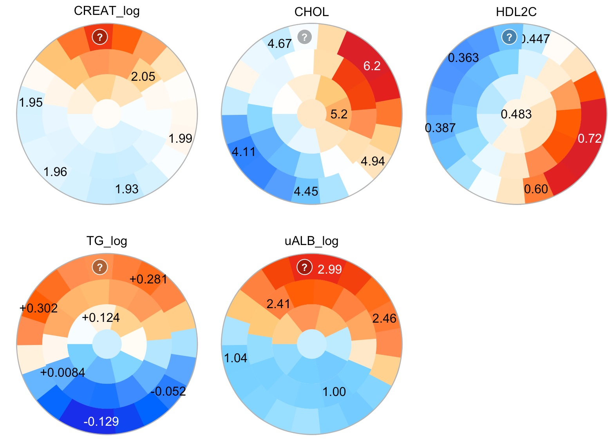
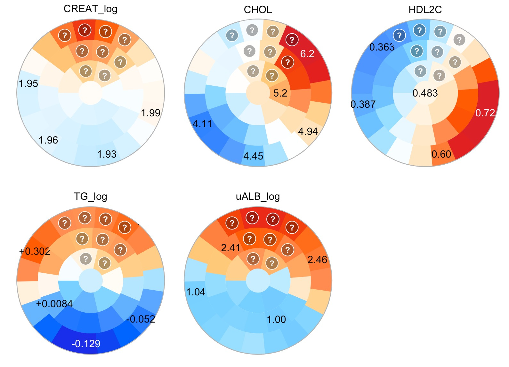
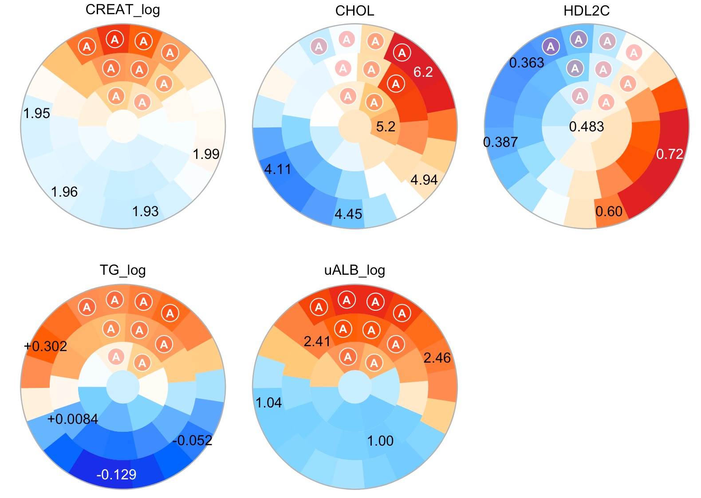

```{r setUpLibrary, eval=TRUE, include=FALSE}
library(Numero)
```

# Introduction

Pattern recognition and clustering algorithms are the methodological cornerstones of the “big data” paradigm. In biology, high-throughput genomics and detailed imaging techniques are avidly applied to learn the details of how cells work and how diseases develop, and big datasets are expanding at an exponential rate, which also means that biomedical data analysis relies more and more on computational modeling and visualization in addition to the traditional descriptive statistics. The taxonomic tradition in biomedicine to categorize phenomena into distinct easily identifiable boxes remains strong, which explains the popularity of classical algorithms such as principal component analysis and hierarchical clustering as the first and often only choices for visualization and interpretation of the multi-dimensional structure of a complex dataset. However, both methods struggle when the dataset resembles a continuum instead of distinct clusters of data.

In the vignette, we focus on biomedical applications of the `r Biocpkg('Numero')` framework, but there is nothing in the *R* package that is specifically aimed at biology. The choice of diabetic kidney disease as an example reflects our experience in the field, whereas Numero itself can be applied to any analysis problem that involves complex multi-dimensional data.

The document is organized into sections and paragraphs that describe our motivation for developing the library, introduce the concept of the self-organizing map, describe the dataset we use as an example of a biomedical study, go through a complete *R*-script of an analysis pipeline, define metabolic subgroups, interpret the results and discuss the role of the map analyses in publications. 

## Limitations of conventional categorization

The conventional notion of qualitative data patterns (e.g. health vs. disease) fits well with clustering algorithms that aim to find discriminatory borders automatically within the data. However, we argue that many biomedical datasets do not have a qualitative structure of regularity, but they instead reflect a multivariable spectrum of causes and consequences where the borderline between health and disease is blurred. For instance, chronic kidney disease is defined according to an internationally accepted threshold of glomerular filtration rate (GFR < 60 mL/min 1.73 m^2^, [@levey2012chronic]), but there is no mathematically identifiable threshold effect in the population-based GFR distribution or any other biomarker or physical characteristic, as demonstrated by the continuous discussion on diagnostic criteria [@delanaye2012]. Therefore, in most cases it is impossible to say exactly when someone develops chronic kidney disease, only that the diagnostic threshold is reached after a gradual decline, after which treatments can be initiated according to consensus guidelines.

Typical clustering analyses rely on algorithms that are tweaked for different application domains to produce classifications that are mathematically optimal, to reproduce an existing gold standard, or to predict future outcomes. We maintain that excessive reliance on mathematical criteria is not useful for datasets without intrinsic clustering structure, since the choice of the criteria will determine the output rather than the data or practical usefulness of the classification. Furthermore, the process that leads to category assignments is often too complicated to understand on a practical level, so the human observer must rely on the “black box” to produce the classification results without access to the inner workings. We propose a half-way solution, where the aim is to simplify the data presentation with statistical verification so that a human observer can determine a suitable subgrouping for a specific purpose, yet with sufficient access to the data patterns to understand the characteristics of the dataset in detail.

A traditional strict classification model will work well, if measurable qualitative differences exist. For instance, type 1 diabetes is an autoimmune form of diabetes that develops in children and adolescents. The condition is severe with a short life expectancy if untreated, so type 1 diabetes can be considered a qualitative example of health versus disease. Consequently, highly accurate diagnostic biomarkers such as glucose, insulin and C-peptide already exist. Even when treated, type 1 diabetes has a profound long-term impact on energy metabolism and it represents a distinct data cluster that is separate from the non-diabetic population.

Unlike type 1 diabetes, common age-associated diseases such as chronic kidney disease, type 2 diabetes, and atherosclerosis are challenging from a clustering perspective: they take decades to develop, they are not immediately life-threatening if left untreated, and there is a wide variation in severity across individuals. Furthermore, the affected individuals often suffer from multiple interacting chronic conditions, making it difficult to isolate specific causes and symptoms. Therefore, the simplistic notion of a qualitative threshold between health and disease becomes problematic. We aim to address these challenges by creating subgroups that are of practical value beyond mathematical criteria, and guided by a human observer with access to understandable presentations of the multivariable data patterns.

Multiple co-occurring and inter-connected phenomena are hallmarks of complex systems and the observable data that can be obtained from them. This presents a challenge to the traditional paradigms of biomedicine. For instance, differential diagnostics cannot cope well with multiple overlapping diseases, or evolving degrees of severity. This motivated us to develop the `r Rpackage("Numero")` framework in such a way as to enable visual comparisons of multiple overlapping diagnoses and their diagnostic criteria. We expect the `r Rpackage("Numero")` to be highly valuable in situations where the most important outcome or a set of outcomes is not obvious (e.g. competing risk scenarios). For instance, patients with type 1 diabetes may develop serious injuries to their vasculature over decades, but the affected organs, severity and rate of progression vary. Therefore, predictive models that focus only on a single outcome at a time may miss the big picture. The example of diabetic kidney disease we use in this vignette demonstrates how to use the `r Rpackage("Numero")` framework to gain insight into the overlaps and longitudinal associations between multiple morbidities.

## Self-organizing map

Expressing multivariable data in visual form is a critical part of any knowledge discovery process, and an extensive number of algorithms have been developed in recent decades. In many cases, the aim is to project a set of multivariable data points into a two-dimensional presentation for human viewing (Figure \@ref(fig:legumes)). We built the `r Rpackage("Numero")` package using the self-organizing map (SOM) algorithm [@kohonen2001], which is based on only a few simple mathematical rules, does not break down from missing data and can handle a high number of variables. We also developed a method to estimate the statistical significance of the map patterns [@makinen_1h2008]. Of note, the modular structure of the library allows users to replace the SOM with any other suitable algorithm for customized analysis pipelines.

```{r legumes, eval=TRUE, echo=FALSE, fig.cap="A conceptual example. The example shows how to organize objects with multiple features into a two-dimensional layout. The images were obtained from @cardoso2014taxonomic."}
knitr::include_graphics("legumes.jpg")
```

Conceptually, the SOM algorithm mimics a human observer who wants to make sense of a set of objects. For instance, Figure \@ref(fig:legumes)A depicts schematic drawings of the flowering legume genus Luetzelburgia that grows in South America [@cardoso2014taxonomic]. Figure \@ref(fig:legumes)B shows how a human observer might organize the drawings based on their visual similarities (shape, size and other morphological details). By organization, we refer to the spatial layout of the drawings on the two-dimensional canvas: drawings that look similar are close to each other, whereas drawings that look different are far apart (in most cases). This is how all people, from children to elderly, sort and classify their objects with multiple observable features (= multivariable data points) with the help of a two-dimensional surface (= data map). The same observer then decides how to split the dataset into subgroups based on his or her domain knowledge.

If there are thousands of drawings, manual organization becomes impractical. For this reason, we let the SOM algorithm to do the first organization step, and to visualize the salient patterns within the dataset in a two-dimensional data map. The spatial principle still applies: multivariable data points that have similar values are close to each other, whereas data points that are different are on the opposite sides of the map. The second step of defining subgroups remains the responsibility of the observer. We argue that this type of data-assisted subgrouping is particularly useful in situations where there is no qualitative threshold between health and disease, but a line must be drawn to initiate preventative measures or treatments.

Although there are only 18 drawings in Figure \@ref(fig:legumes), the nature of the dataset resembles many epidemiological studies. Specifically, some of the drawings are very similar, but it is not obvious how they should be classified into subgroups (i.e. our version of the figure can be disputed, a single “correct” visual subgrouping may not exist). If the classification was based on the height of a drawing, the results would look different compared to using the width – some drawings are narrow while being long, whereas others are wide despite being short. This is a naïve example on how the selection of the mathematical criteria for classification has a substantial impact on the results, and illustrates the motivation for our work. We developed the `r Rpackage("Numero")` library as an alternative tool that helps researchers to define meaningful groupings when pure mathematics cannot provide a conclusive answer.

Previous versions of the software (written for Matlab) were successfully used on a range of metabolomics and other biomedical studies [@bernardi2010; @kumpula2010; @kuusisto2012; @makinen_1h2008; @makinen_metabolic_2008; @tukiainen2008; @wurtz2011; @makinen2013]. However, the old version used a rectangular SOM, which tends to guide observers into picking four subgroups in the corners even when not supported by data. We created the `r Rpackage("Numero")` package with a circular implementation of the SOM to remove the limitations from cornered border shapes. Additional technical details and supportive material are available as an online supplement within a previous publication [@makinen2012].

# Terminology

**Data point** -– Here, we define the term *data point* as a single uniquely identifiable row in a spreadsheet of data (with variables as columns). For instance, in the diabetic kidney disease dataset described in the next section, a *data point* refers to a patient (and vice versa) as there is only one row per patient.

**Map** –- A *map* is a general term to describe the two-dimensional canvas onto which the multivariable data points are projected. The concept is analogous to a geographic *map* that indicates where people live, except that the location is not based on geography (i.e. physical distances), but comes from the data (i.e. distances = data-based similarities).

**Layout** –- We make a distinction between what is a map, and what is the *layout* of data points on it. The *layout* is a table of data point locations as coordinates, whereas the map is a more integrated concept that also includes information that is necessary to find the locations of new previously unseen data points, and to draw and paint the map in visual form.

**District** –- A *district* refers to a pre-defined division of the map into uniformly sized areas. The *districts* are created mainly for technical reasons: using *districts* speeds up calculations and enables the estimation of map-related statistics. This is analogous to a real city being divided into *districts* to estimate regional demographics, for instance.

**Coloring** –- The Numero framework always creates a single map. However, the map districts can be painted with different colors. This enables the user to create multiple *colorings* of the map to visualize regional differences. These *colorings* can be made for each variable, which helps to identify which parts of the map are particularly important for a specific phenomenon. Again, this is similar to a real city map where the districts are colored according to the income level of the local residents, or according to the mean age, smoking rates, obesity etc.

**Subgroup** –- We expect that most uses of Numero will result in the subgrouping of a complex dataset. Visually, we define a *subgroup* via a contiguous set of adjacent districts on the map. Consequently, all the data points that are located within the set of districts are the subgroup members.

**District profile** –- The SOM algorithm works through the districts during the optimization of the data point layout on the map. The computational process eventually converges to a stable configuration that is stored as a set of *district profiles*. From a practical point of view, a *district profile* represents the typical average profile that captures the characteristics of the data points within the district. In technical terms, the *district profile* (also known as the prototype) contains the mean weighted data values across all the data points, where the weights are determined by the neighborhood function used in the SOM algorithm.

**Best-matching district** –- The *best-matching district* (BMD, also known as the best-matching unit in the literature) is the district with a profile that is the most similar to a data point when considering all variables simultaneously. The BMD is closely related to the data point layout: the assigned location for a data point is the location of the BMD for that data point.

# Example dataset of diabetic kidney disease

Diabetic kidney disease is the leading indication for dialysis and kidney transplantation in the developed countries, and carries a substantial risk of premature death due to cardiovascular disease. About one third of individuals with type 1 diabetes will develop diabetic kidney disease during their lifetime. As the age of onset of type 1 diabetes is in childhood or adolescence, these individuals will develop complications at a relatively early age. Therefore, people with type 1 diabetes represent a particularly vulnerable group facing lower quality of life and reduced life span due to kidney damage.

Albuminuria (elevated albumin concentration in urine) is the basis for the clinical classification of diabetic kidney disease. In this example, we applied the threshold of 300mg/24h, if 24h urine collections were done and 0.2 mg/min when overnight urine data were available from the local medical centers that examined the patients. If the threshold was exceeded in at least two out of three consecutive measurements, we assigned the individual in the diabetic kidney disease group. In addition, the FinnDiane Study Group measured urinary albumin excretion rate from a single 24h urine sample in their designated central laboratory. The logarithm of the albumin excretion rate was included in the example dataset.

Our example dataset contains a subset of data from a previous publication [@makinen_1h2008]. We created the simplified dataset for educational purposes, but it contains enough information to replicate some of the findings from the original study. The dataset includes 613 individuals of whom 225 individuals had diabetic kidney disease at baseline. In addition, we included information on whether an individual had died after an eight-year follow-up to demonstrate how the study design we chose can be applied to longitudinal data. The available data are summarized in Table \@ref(tab:summary).

Trait                              | No kidney disease | Diabetic kidney disease | P-value
---------------------------------- | ----------------- | ----------------------- | --------
Men / Women                        |     192 / 196     |     119 / 106           | 0.45
Age (years)                        |     38.8 ± 12.2   |     41.7 ± 9.7          | 0.0012
Type 1 diabetes duration (years)   |     25.3 ± 10.3   |     28.6 ± 7.8          | <0.001
Log10 of AER (mg/24h)              |     1.20 ± 0.51   |     2.72 ± 0.59         | <0.001
Log10 of TG (mmol/L)               |     0.034 ± 0.201 |     0.159 ± 0.212       | <0.001 
Total cholesterol (mmol/L)         |     4.89 ± 0.77   |     5.35 ± 0.96         | <0.001 
HDL2 cholesterol (mmol/L)          |     0.54 ± 0.16   |     0.51 ± 0.18         | 0.027
Log10 of serum creatinine (µmol/L) |     1.94 ± 0.09   |     2.14 ± 0.24         | <0.001 
Metabolic syndrome                 |     90 (23.2%)    |     114 (50.7%)         | <0.001 
Macrovascular disease              |     16 (4.1%)     |     38 (16.9%)          | <0.001 
Diabetic retinopathy               |     133 (34.4%)   |     178 (79.1%)         | <0.001
Died during follow-up              |     13 (3.4%)     |     43 (19.1%)          | <0.001
  
: (\#tab:summary) Summary of the diabetic kidney disease dataset from the FinnDiane Study. The mean and standard deviation are reported for continuous variables. Abbreviations: urinary albumin excretion rate (AER), triglycerides (TG), high density lipoprotein subclass 2 (HDL2). P-values were estimated by the t-test for continuous variables and by Fisher’s test for binary traits.

# Aims and study design

In the original study, we hypothesized that the metabolic profile of an individual with type 1 diabetes at baseline predicts adverse events in the future [@makinen_1h2008]. Here, we set two aims to test the same hypothesis in the example dataset:

1.	Define metabolic subgroups of type 1 diabetes based on biochemical data.
2.	Identify subgroups with high all-cause mortality.

We chose these aims to accommodate a high number of variables and to ensure statistical robustness. Please note that we included only a few variables in the example dataset for pedagogical reasons, but the SOM in the original study was created based on thousands of variables.

The strict separation of Aim 1 and 2 is an example of an unsupervised classification design where the metabolic subgroups are created without using the mortality data. Only after the subgroup modeling has been completed, the deaths during follow-up will be counted within the subgroups. An alternative would be to employ regression or other supervised methods that use all the available data simultaneously to create a predictive model of mortality. While supervised models can achieve high accuracy, they rarely work well outside the dataset they were created for, and they may fail if the outcome to be predicted is poorly defined or biased. For these reasons, we adopted the more robust unsupervised classification design.

We denote the study design as “split-by-variables” since it starts from a spreadsheet with one patient per row and the variables organized into columns, and then assigns one set of variables into the training set, and the remaining variables (e.g. deceased or alive at follow-up) into the evaluation set (Figure \@ref(fig:splitFig)). Since the evaluation set plays no part in the training of the SOM, we can estimate the statistical significance of the mortality pattern without over-estimating the model accuracy.

```{r splitFig, eval=TRUE, echo=FALSE, fig.cap="Application of the split-by-variable study design in the diabetic kidney disease example. Of note, the training set is adjusted for sex differences; hence the ‘MALE’ column is not formally included in the evaluation set."}
knitr::include_graphics("split.jpg")
```

# Statistical analysis

The architecture of the analysis pipeline for the diabetic kidney disease example is detailed in Figure \@ref(fig:pipeline). First, we describe how to preprocess the data for analysis (Figure \@ref(fig:pipeline)A-D). Next, we create the SOM based on the training set (Figure \@ref(fig:pipeline)B,E). The third segment focuses on map statistics and how to color the maps according to regional variation (Figure \@ref(fig:pipeline)F,G). Lastly, we discuss the interactive subgroup selection and interpretation of the results (Figure \@ref(fig:pipeline)H,I).

```{r pipeline, eval=TRUE, echo=FALSE, fig.cap="Analysis steps in the diabetic kidney disease example."}
knitr::include_graphics("pipeline.svg")
```

## Preprocessing

We have included the example dataset in the installation package. To access it, type

```{r setUpExample, eval=TRUE}
fname <- system.file("extdata", "finndiane_dataset.txt", 
                     package = "Numero")
db <- read.delim(file = fname, sep = "\t")
summary(db)
```

We hypothesize that the metabolic phenotype of an individual predicts future adverse outcomes. To investigate the hypothesis, we select all blood and urine biomarkers at baseline as the training set (Aim 1), and then use the remaining columns that contain data on clinical end-points and mortality as the evaluation set (Aim 2).
```{r preproc0, eval=TRUE}
trvars <- c("CREAT_log", "CHOL", "HDL2C", "TG_log", "uALB_log")
```

If our hypothesis is correct, we should see a statistically significant regional pattern for mortality on the SOM that we constructed based on the metabolic variables at baseline. This is the split-by-variable study design that was previously described in Figure 2.

In the data file, the biomarkers are expressed in their physical concentration units, or as log-transformed versions. As a consequence, the standard deviations of the data columns vary, which can bias the SOM to fit better to those biomarkers that have a wide numerical variation. In most cases, it is desirable to standardize the training set before analyses, so that the information content rather than the measurement scale determines the modeling outcome.

Sex difference is another factor to consider when preparing the training set. Men and women display anatomical and metabolic differences, which usually complicate the interpretation of the SOM. For this reason, we recommend using a sex-specific standardization procedure that eliminates the differences. If necessary, separate visualizations can be made afterwards for men and women using the same map, please see @makinen2012 for an example.

The Numero package contains a pre-processing function that checks the data for unusable rows and columns, and we can use it to center and scale the data for men and women separately. Our dataset contains an explicit identity column. Therefore, it needs to be declared in the pre-processing function. The function consequently assigns these identifiers as row names in the output. If no key column is provided, then the row names are copied as such.

```{r preproc1, eval=TRUE}
db <- nroPreprocess(data = db, training = trvars, strata = "MALE",
                    key = "INDEX")
```

The function returns a list with three members:

* *original* contains a subset of the original dataset were unusable rows were removed,
* *values* contains those columns that could be converted to numbers,
* *features* contains the standardized training columns.

You can verify that the training data is zero centered by typing the following commands that will produce the output below:

```{r preproc2, eval=TRUE}
men <- which(db$values[,'MALE'] == 1)
women <- which(db$values[,'MALE'] == 0)
print(summary(db$features[men,]))
print(summary(db$features[women,]))
```

## Initializing a self-organizing map

Training a SOM requires two steps: i) initialization of the map and ii) iterative optimization of the district profiles. The initialization of district profiles influences the usability of the final map, and several methods including principal component analysis have been proposed [@attik2005]. Our experience suggests that the most useful results are usually achieved by creating a limited number of seed profiles that are placed on the edges of the map. The districts in the middle are set automatically in such a way that the transition from one seed to another via the districts in the middle is smooth. The Numero package includes the *nroKmeans()* function which we use here to determine the seed profiles. It is based on the classical k-means algorithm, but our implementation is specifically designed for datasets with missing data and to produce output that is compatible with other Numero functions.

The minimum number of seeds is three as the triangle is the simplest polygon to cover the map. To create the seed profiles, you can use the command

```{r init1, eval=TRUE}
km <- nroKmeans(data = db$features, k = 3)
```

The output is a list that contains three named elements: 

* *centroids* contains the seed profiles, 
* *layout* the best matching labels of each row, and 
* *history* the history of training errors. 

To show the seeds, type the following command. The seed profile output has the same columns as the training data.

```{r init2, eval=TRUE}
print(km$centroids)
```

Most SOM software is based on rectangular or borderless maps with periodic boundaries. In our experience, the former suffer from an artificial tendency for observers to define four separate subgroups in the corners. The latter do not suffer from boundary artifacts, but are complicated to interpret. For these reasons, we developed a circular map topology for Numero since it does not have corners and yet the well-defined borders limit the visual complexity of the regional patterns.

The preferred size of the map depends on the number of data (small maps for small datasets), however, we advise against using large maps due to their complexity. For most biomedical and epidemiological applications, map radii between two and five will provide enough flexibility and expressive power based on our experience.

To initialize a circular map with a radius of three districts according to the seed profiles, use the command

```{r init3, eval=TRUE}
sm <- nroKohonen(seeds = km$centroids, radius = 3)
```

This will create the initial matrix of district profiles, and additional topological information that will be required for visualization. To show the district profiles, type the following command that will show how the profiles have the same format as the seeds:

```{r init4, eval=TRUE}
print(head(sm$centroids)) 
```

## Training the self-organizing map

Kohonen’s self-organizing map algorithm was originally developed to mimic the plasticity of neural networks [@kohonen2001]. It scales up well for datasets with a high number of variables, and it can handle missing data values, which is why we chose it as the default method in Numero. To apply the SOM algorithm to the standardized training set, use the command

```{r train1, eval=TRUE}
sm <- nroTrain(som = sm, data = db$features)
```

The *nroTrain()* function updates the district profiles in such a way that when the data points are assigned the best-matching districts (BMD), the resulting layout is distributed more evenly across the map. BMDs and the data point layout are discussed in the next section.

The *nroTrain()* function adds a record of the training process within the output list. To plot it on screen, type

```{r train2, fig.cap = "SOM training history in the diabetic kidney disease example.", eval=TRUE}
plot(sm$history)
```

The results are shown in Figure \@ref(fig:train2). The curve shows the mean Euclidean distance between a data point and its best matching district profile for each training cycle. In most cases, the first few cycles account for the largest reductions in the training error. The abrupt reduction that can be observed after the first few cycles is part of the training process. For those interested in the technical details, switching from a wide neighborhood function to a narrower one causes the threshold. This is beneficial, since by starting the training process with a wide neighborhood function forces the SOM to adapt to large (and presumably more important) patterns first before adapting to the minor details.

We have included additional tools in the Numero package to assess the internal properties of the SOM given a training dataset. However, the full use of these tools requires visualization functions that are not covered until later in the document. For this reason, we will return to this subject in a dedicated section after introducing map colorings.

## Best-matching districts and data point layout

The application of the SOM algorithm mimics a human researcher who wants to investigate the cohort of type 1 diabetic patients. Suppose the researcher goes through the medical records of all `r nrow(db)` individuals and then organizes the folders on a giant round table in such a way that patients with mutually similar clinical profiles are placed next to each other, whereas patients who are different are on opposite sides of the table. From this organized view, it is then possible to identify sections of the table (= patient subgroups) where there is a high risk of premature death.

To translate the story of the human researcher into a computer program, it is necessary to introduce new concepts and it is also useful to revisit to pre-defined terminology from the beginning of the document. First, the map (representing the giant round table) is divided into districts for technical reasons since the type of manual positioning algorithm a human would apply is unfeasible for large datasets. The districts are also anchors that enable the assignment of the patients onto specific map positions, again important for technical reasons.

The best-matching district (BMD) for a data point is the second important concept. Each data point is compared against a district profile by calculating their pair-wise Euclidean distance. This is repeated across the districts, and after the distances between the data point and all district profiles are calculated, the profile with the shortest distance is chosen as the best match. When the BMDs are located for all data points, the results are collected in a spreadsheet, which we denote as the data point layout. The layout is conceptually equivalent to the spatial configuration of folders on the human researcher’s table.

To create a layout, you can use the command

```{r match1, eval=TRUE}
matches <- nroMatch(som = sm, data = db$features)
```

The output is an integer vector with elements corresponding to the rows in training data and each element contains the index of the best matching district. The vector also has the attribute *quality*. To print a section of the quality output on screen type the following command. Its output will be a data frame with three columns: 

```{r match2, eval=TRUE}
head(attr(matches,'quality'))
```

The column RESIDUAL shows the Euclidean distance between a data point and the BMD (the shorter the better). QUALITY is calculated from the distance by dividing it with the average training error. This provides a scale-independent relative estimate on how well the data points were matched compared to a typical data point in the training set. Finally, COVERAGE shows if a multivariable data point contained missing elements (1 means all elements were usable and 0 means none of the elements contained a numerical value).

Ideally, the data points should be uniformly distributed across districts. While uniformity is rarely observed for real datasets, uneven numbers are usually not a problem unless there are large contiguous groups of districts with very high or very low occupancy. We will revisit the spatial data point distribution in a later section that addresses map quality, but a tabulation of the BMD assignments is a quick way to see if the output is reasonable

```{r match3, eval=TRUE}
t <- table(matches)
counts <- data.frame(DISTRICT = names(t), N = as.integer(t))
print(counts, row.names = FALSE)
```

If a large number of districts in the above output were devoid of data points, it would indicate that the map did not capture the diversity of the data set, and therefore would not be useful for subgrouping. However, the data points are scattered across all districts in this example, which suggests the layout will be useful.

## Map statistics

Statistical evaluation of whether an observation is likely to occur purely by chance is the cornerstone of biomedical data analysis. In our example, we achieve well-defined statistical analyses via the split-by-variable design and the non-parametric permutation engine that is built into the package. The former ensures that our results are not over-optimistic (no over-fitting) and the latter enables us to avoid restrictive assumptions on the nature of the data generating processes that are often violated in real datasets.

In our example, we investigate if the metabolic profile at baseline indicates the risk of death during follow-up. To estimate statistical significance, it is necessary to find out how much the areas of the map can differ with respect to mortality just by the virtue of random fluctuations. This concept is formally encapsulated by the null hypothesis. Here, the null hypothesis states that the data point layout is not associated with the number of deaths, that is, the location of a patient on the map does not provide any information on how likely the patient is to die in the next eight years. If the null hypothesis is true, then the observed layout and regional patterns of mortality should be within the variation we would expect for random layouts. We use permutation analysis to simulate a high number of random layouts, and then compare the observation with the simulated findings to see if it could have occurred by chance alone [@makinen_1h2008].
Within the split-by-variable design, P-values for statistical significance are only meaningful for those variables that are in the evaluation set since, by definition, the variables in the training set will always be strongly associated with the layout. However, it makes sense to evaluate the expected range of regional variation also for the training set, as we will demonstrate later in the vignette. Knowing the randomly expected amplitude of regional patterns (i.e. the basal amplitude) helps us to assess which of the training variables had the strongest influence on the layout. For these reasons, we will apply the permutation analysis to all variables, but only report P-values for the evaluation set.

The function *nroPermute()* repeats the following procedure: i) re-assign best-matching district randomly in accordance with the null hypothesis, ii) recalculate the average district values across the map and iii) summarize the regional variation with a single descriptive statistic. When a sufficient number of cycles has been achieved, the null distribution of the descriptive statistic is analyzed to determine how far, in terms of standard deviations, the observed value is from the mean prediction by the null hypothesis. This distance is reported as the Z-score of regional variation. Furthermore, the function also estimates how frequently a permuted layout produced a regional variation that exceeded the observation (frequency-based P-value).

The *nroPermute()* function goes through all variables in a dataset. Please note that we calculate the statistics on the data frame *value* (it only contains numeric values without a key column or unusable rows). Internally, we also distinguish between a training variable (no P-value needed and we can use fewer cycles) and an evaluation variable that is tested with larger number of cycles. The function call is shown below:

```{r permute1, eval=TRUE}
stats <- nroPermute(som = sm, data = db$values, 
                    districts = matches)
```

To see the results, type the following command:

```{r permute2, eval=TRUE}
print(stats)
```

The Z column contains Z-scores that indicate how far the observed regional variation is from the mean expected value if the null hypothesis is true. P.z is a parametric estimate for statistical significance based on the Z-scores using the cumulative Gaussian distribution, whereas P.freq is the frequency-based estimate for statistical significance. It is calculated by using the frequency of observing regional variation for a simulated random layout that exceeds the observed variation. N.data indicates how many data values were used, N.cycles tells the number of completed permutations. The column TRAINING indicates whether a variable has been used during the training process. Please note how the P-values are missing for those variables. AMPLITUDE contains the dynamic range for colors that can be used in map visualizations. The amplitudes are required for the assignment of district colors and will be described in closer detail later.

# Visualization

After estimating the map statistics, we now have all the results that are required to color the map according to the data patterns: the topological information that is carried within the variable *sm* allows us to draw the districts correctly, the data point layout specifies the locations of the `r nrow(db)` patients on the SOM, and the color amplitudes.

## Color Amplitudes

Assigning a color palette to a set of values is not much different from photography. When a photo is taken, the intensity of light is converted into numbers by the digital camera, and then converted back to light on the viewing screen. If there is too much light, the photo gets overexposed, which means that most pixels show up as “burned” since the intensity is beyond their dynamic range (i.e. light saturates the sensor). If the photo is underexposed, most pixels will show a zero signal (i.e. the light is below the detection limit). In principle, the SOM colors work the same way: we aim to set up an optimal color assignment so that the colorings with very high regional variation do not over-expose too much, while the colorings with less regional variation can still show differences between districts despite under-exposure.

In the `r Rpackage("Numero")` framework, a photo corresponds to a map coloring (please revisit Terminology if necessary), light intensity is analogous to statistical significance (captured by z-scores), and the dynamic range is the gap between the lowest and highest district averages. Importantly, the “camera settings” are kept constant to ensure all colorings remain visually comparable. Ideally, the camera would be set up so that the full dynamic range of every coloring could be expressed within the available color palette. However, this approach is usually impractical as interesting detail could be lost for variables that show statistically modest but biologically critical variation. The dynamic range of colors is stored in the AMPLITUDE column of the output of *nroPermute*.

In brief, Z-scores indicate the statistical support for the observed regional variation. But before the information can be visualized, the Z-scores have to be converted to color amplitudes so that the map coloring reflects the strength of the statistical evidence.


## Color and label assignment

The color of a district depends on the estimated mean value across its local resident data points. To calculate the district values, use the command

```{r color1, eval=TRUE}
comps <- nroAggregate(topology = sm$topology, data = db$values,
                      districts = matches)
```

The output of the function is a data frame containing the average district values.

In the SOM literature, the set of district mean values for a variable are typically referred to as the component plane, hence the name of the output. We now have all the materials to assign colors to each district based on i) the amplitudes for each variable, which tells how much “exposure” the camera provides, and ii) the component plane, which gives the dynamic range and district means:

```{r color2, eval=TRUE}
colrs <- nroColorize(values = comps, amplitudes = stats$AMPLITUDE)
```

The output is a data frame of colors in a format that matches the values in the component plane and can be used in subsequent Numero functions.

Due to the standardization by z-scores, the colors are not directly relatable to the original measurement units, or to the original binary categories. For this reason, text labels that indicate the actual mean values for selected districts are a useful visual addition to the final map plot. To create a set of labels for the map coloring, use the command

```{r color3, eval=TRUE}
labls <- nroLabel(topology = sm$topology, values = comps)
```

## Graphics output

The `r Rpackage("Numero")` package contains functions to visualize map colorings on screen, to create interactive map colorings to define subgroups and to save those colorings in the Scalable Vector Graphics (SVG) format to a file.

To see the all map colorings on screen (Figure \@ref(fig:gout0)), use the following command
```{r gout0, eval=TRUE, fig.cap="Statistically normalized colorings of all variables in the kidney disease dataset. The color intensity depends on how likely the observed regional variation would arise by chance; intense reds and intense blues indicate that these extremes would be very unlikely if the data point layout was random."}
elem <- nroPlot(elements = sm$topology, colors = colrs,
                labels = labls, values = comps)
```

To save the plots into an SVG file, you can use the same command and providing a file name as parameter. The following command is not executed upon the creation of the vignette but serves as an example only.

```{r gout1, eval=FALSE}
nroPlot(elements = sm$topology, colors = colrs,
                labels = labls, values = comps, file = 'test.svg')
```

It is possible to direct the figure to any of the R graphics devices, including the SVG device, but the Numero SVG file will be cleaner and structured in a way that makes it easier to be manually edited in graphics programs such as Inkscape.

# Results and interpretation

In the final section, we summarize and discuss the results of the SOM analysis. As previously mentioned, the big open problems in biomedicine and public health are typically characterized by multiple synergistic risk factors that produce a gradual decline in biological functions over time. For this reason, the observed data patterns are not likely to be self-explanatory, but will require additional analyses and contextual assessment with respect to how the original data was collected and what are the clinically impactful findings.

## Map quality

Before delving into the characteristics of diabetic kidney disease, it is prudent to examine the SOM for potential problems with the data. The Numero package provides three different quality metrics: i) the data point histogram reveals problems of misrepresentation between the data points and the district profiles, ii) the coverage map shows systematic patterns of missing data that may influence the results, and iii) the matching quality indicates subgroups of data points that may have been modeled poorly.

To calculate all three, we can use the *nroAggregate* function and input the quality measures that have been calculated by *nroMatch*.

```{r quality0, eval=TRUE}
comps.qc <- nroAggregate(topology = sm$topology, 
                         data = attr(matches, "quality"),
                         districts = matches)
```

The output contains the district averages for the quality metrics. In addition, nroAggregate always estimates the spatial histogram that tells how many samples are within each district, and returns it as an attribute. To add the histogram information to the quality visualization, we copy the attribute into a new column in the data frame:

```{r quality1, eval=TRUE}
comps.qc$HISTOGRAM <- attr(comps.qc, "histogram")
```

The output format is equivalent to what was used for the map colorings, so the same code sequence is applied to create an SVG figure. To make a distinction between diagnostic and other colorings, we use a different color palette for the *nroColorize* function:

```{r quality2, eval=TRUE}
colrs.qc <- nroColorize(values = comps.qc, palette = "fire")
labls.qc <- nroLabel(topology = sm$topology, values = comps.qc)
```

Again, we can use the *nroPlot* function to visualize the results on screen.

```{r quality3, eval=TRUE,  fig.cap="Visualization of SOM quality metrics. Light (dark) colors indicate high (low) values. The color intensity was not normalized statistically. Coverage indicates the proportion of usable data values, residuals indicate model fit (smaller value is better), quality is a scale-independent measure based on the residuals (larger is better). Finally, the histogram shows smoothed estimates on how many samples were assigned to each district."}
elem.qc <- nroPlot(elements=sm$topology, colors=colrs.qc,
                labels=labls.qc)
```

We observed coverage close to 1 across the map, which reflects the low frequency of missing elements in the original data matrix (Figure \@ref(fig:quality3)).

There are two ways to show matching quality, either by coloring the map according to the mean matching errors for districts, or by examining the matching errors of individual data points (also referred to as quantization errors or model residuals). These are shown in the colorings for RESIDUAL and QUALITY in Figure \@ref(fig:quality3). Again, some regional differences are expected, but there were no indications of serious problems. In particular, the relative quality even in the worst region was close to the average training quality (i.e. close to one).

Finally, the HISTOGRAM coloring in Figure \@ref(fig:quality3) shows that there were noticeable differences between the districts. However, there was a sufficient data point count everywhere on the map and, based on our experience from previous studies, it is unlikely that the results were adversely affected due to sparse representation.

## Summary of map colorings

**Important note on reproducibility:** The `r Rpackage("Numero")` framework uses optimized code that reduces memory footprint and computational burden. For this reason, different computers, particularly 32-bit vs. 64-bit architectures, may produce map patterns that have been flipped, mirrored, rotated or otherwise transformed when compared with the figures in the vignette. This is a technical limitation due to machine precision, not an unintentional mistake in the code. 

As discussed earlier, we used the split-by-variable study design in this example. This meant that the SOM was trained using a subset of the available variables (biochemical data), which allowed us to investigate the associations with the clinical variables without a high risk of overfitting. To visualize the results, we follow the same logic. Below, we first investigate the training data to get insight into the metabolic profiles and diversity within the dataset. This will also allow us to define biochemical subgroups from a multivariable perspective. Later on, we will overlay the clinical variables onto the map to identify subgroups of clinical importance. 

```{r biochemistry, eval=TRUE, fig.cap="Statistically normalized colorings of the training variables in the kidney disease dataset. The color intensity depends on how likely the observed regional variation would arise by chance; intense reds and intense blues indicate that these extremes would be very unlikely if the data point layout was random."}
trvars <- colnames(db$features)
elem <- nroPlot(elements=sm$topology, colors=colrs[,trvars],
                    labels=labls[,trvars])
```

Figure \@ref(fig:biochemistry) shows the map colorings for the training set. Serum creatinine (log-transformed) was substantially higher for a subset of individuals located on the top part of the map compared to the lower part, and a similar pattern was found for the log-transformed measurements for urinary albumin excretion. As elevated serum creatinine and urinary albumin are hallmarks of kidney disease, it is likely that the individuals who were assigned to the top part of the map had kidney disease as the underlying explanation.

The patterns for the lipids were more complicated. Cholesterol showed a pattern of high concentrations in the upper right area and low concentration in the bottom left, whereas HDL2 cholesterol was the highest in the bottom-right and the lowest in the upper-left. Triglycerides (log-transformed) showed a general pattern of high concentrations on the upper part of the map.

We recommend using the SOM together with conventional approaches such as linear correlations, for broader understanding of the nature of the dataset. For instance, cholesterol and triglycerides were correlated (r = 0.43, P < 0.001), however, the SOM colorings suggest that the correlation may not apply to all individuals; particularly those in the upper-left area with high triglycerides did not seem to follow the linear trend. Other dimension reduction methods such as principal component analysis may work better in datasets where there are clear clusters (a typical SOM analysis may miss the clustering structure) and, again, we recommend using multiple conceptually different methods to achieve robust conclusions. We did not observe any obvious clustering structure in the kidney disease dataset (results not shown).

## Subgroup boundaries

The aims of the example study were i) to define and describe metabolic subgroups of type 1 diabetes, and ii) to investigate how the subgroups are associated with mortality. The ability to choose subgroups boundaries on the map while simultaneously observing multiple variables is the main strength of the Numero framework. Furthermore, the intensity of the colorings guides the process towards selecting criteria that have the strongest statistical support. 

The `r Rpackage("Numero")` framework offers an interactive way to define subgroups. To start the interactive process to define subgroups based on the biochemical variables used in training, run the following command:
```{r sub1, eval=FALSE}
trvars <- colnames(db$features)
elem <- nroPlot(elements=sm$topology, colors=colrs[,trvars],
                    labels=labls[,trvars], interactive=TRUE)
```

Subgroups can be defined interactively by clicking onto districts in the map colorings in the plot window. We will step through one example defining the subgroup with high creatinine.

As a vignette does not allow for an interactive process, we will provide screenshots of the process in the following section.

After running the above command, the training colorings are shown in the plot window. We click on the district with the highest creatinine measure on the CREAT_log map coloring as shown in Figure \@ref(fig:step1). 

```{r step1, eval=TRUE, echo=FALSE, fig.cap="Screenshot: Interactive definition of subgroups - step 1: Choosing the district with the highest creatinine value.", out.width = "650px"}

```

Now, we choose other districts that we want to add to this subgroup (Figure \@ref(fig:step2)). Clicking on one district in a coloring, also updates the corresponding district in all other colorings.

```{r step2, eval=TRUE, echo=FALSE, fig.cap="Screenshot: Interactive definition of subgroups - step 2: Choosing other districts with a higher creatinine value.", out.width = "650px"}

```

Once all districts belonging to this first subgroup have been chosen, a click into the plot window outside of a coloring will exit the selection process. The console window will then ask to provide a descriptive name for the subgroup and to confirm the selection. Here, we choose the name *High creatinine* (Figure \@ref(fig:step3)) and confirm the subgroup. After that the district will be labeled with *A* indicating the first subgroup (Figure \@ref(fig:step4)).

```{r step3, eval=TRUE, echo=FALSE, fig.cap="Screenshot: Interactive definition of subgroups - step 3: Subgroup name and confirmation."}
knitr::include_graphics("step3.jpg")
```

```{r step4, eval=TRUE, echo=FALSE, fig.cap="Screenshot: Interactive definition of subgroups - step 4: Updated interactive plot after subgroup confirmation.", out.width = "650px"}

```

Subgroups are automatically labeled from A to Z in the graphical output. A district selection can be changed by clicking on top of it.

Now, we continue defining subgroups in the same manner until all districts have been chosen. Then, we press the finish button at the top right of the plot window and confirm that the session should be terminated. Map visualizations that contain the subgroup choices can be saved using the following command:

```{r sub2, eval=FALSE}
nroPlot(elements=elem, colors=colrs, labels=labls, file="subgroups.svg")
```

In this case, we have decided to define 5 subgroups. The overall result of the subgrouping efforts with above command are illustrated in Figure \@ref(fig:subGroupOverview). Note, this figure was pre-created outside the vignette.

```{r subGroupOverview, eval=TRUE, echo=FALSE, fig.cap="The five subgroups in the diabetic kidney disease example. The grouping is the result of the example interactive process. The SVG was pre-created by saving the results of the interactive process."}
knitr::include_graphics("subgroups.svg")
```

In this example, we have chosen the following descriptive names during the interactive procedure: 

* High creatinine for the subgroup labeled *A*, 
* High cholesterol for the subgroup labeled *B*,
* High HDL2 cholesterol for the subgroup labeled *C*, 
* High triglycerides for the subgroup labeled *D* and
* Low lipids for the subgroup labeled *E*.

While we admit that our choices for the subgroup boundaries were subjective, we also argue that any observer can dispute those choices and provide an alternative by examining the figures. Therefore, the transparency of the methodology allows collective objectivity that is superior to strict “black box” classifiers, especially when the data patterns overlap and involve multiple outcomes.

Please note that the boundaries may not fit exactly with any specific variable, since we also required that the subgroups have to be mutually exclusive. This is the part where there are no perfect mathematical solutions due to overlaps and multi-morbidity.

The second aim of the study was to compare the subgroups with respect to mortality and clinical diagnoses. Graphical comparisons of the metabolic subgroup boundaries and selected map colorings are shown in Figure \@ref(fig:subGroupOverview). Mortality was the highest in the top section of the map (34% in eight years) as seen in the coloring DECEASED, and the same region was also characterized by greater than 90% prevalence of diabetic kidney disease as seen in the DIAB_KIDNEY coloring. As expected the High Creatinine Subgroup (A) captured this segment of the study population. In addition, a few districts with increased mortality and kidney disease prevalence were found within the High Cholesterol Subgroup (B), and similar spill-over was observable also in the High Triglyceride Subgroup (D). On the other hand, the Low Lipids Subgroup (E) showed the lowest rates of death or complications across all the plots in Figure  \@ref(fig:subGroupOverview).

The metabolic syndrome is a clinical entity to describe the co-occurrence of obesity, diabetes, high blood pressure and abnormal blood lipids that is often observed in people at risk of cardiovascular death. Triglycerides and HDL cholesterol comprise the lipid component of the metabolic syndrome, which explains the similar yet different patterns with respect to cardiovascular disease (coloring METAB_SYNDR in Figure  \@ref(fig:subGroupOverview)). In particular, over half of the individuals in the High Triglyceride Subgroup (D) have the metabolic syndrome.

## Subgroup statistics

**Please note** that these results have been generated with a 64-bit machine, and they may be different from the results from 32-bit architectures due to the lower machine precision. If you notice problems, please redefine the subgroups yourself and update the *R*-code accordingly.

The function *nroSummary* calculates the summary statistics for the interactively defined subgroups.

```{r sub3, eval=FALSE}
results <- nroSummary(data = db$values, districts = matches,
                      regions = elem$REGION)
```

```{r sub3b, eval=TRUE, echo=FALSE, warning=FALSE}
results <- nroSummary(data = db$values, districts = matches,
                      regions = c("Low lipids", "High Creatinine", "High Cholesterol", "Low lipids", "Low lipids", "Low lipids", "Low lipids", "High Creatinine", "High triglycerides", "High Creatinine", "High Creatinine", "High Creatinine", "High Cholesterol", "High Cholesterol", "High HDL2 cholesterol", "High HDL2 cholesterol", "Low lipids", "Low lipids", "Low lipids", "Low lipids", "High triglycerides", "High Cholesterol", "High HDL2 cholesterol", "High HDL2 cholesterol", "High HDL2 cholesterol", "High HDL2 cholesterol", "High HDL2 cholesterol", "High HDL2 cholesterol", "Low lipids", "Low lipids", "Low lipids", "Low lipids", "High triglycerides", "High triglycerides", "High triglycerides", "High Creatinine", "High Creatinine", "High Creatinine", "High Creatinine", "High Cholesterol"))
```

It calculates the mean, standard deviation and median for each subgroup and variable and also calculates P-Values using ANOVA, the t statistics and the chi-square test depending on the type of data. Of note, P-Values for variables used in training are set to *NA*. 

Here, we look at the differences in the prevalence of mortality and diabetic kidney disease in each subgroup.

```{r sub4, eval=TRUE}
results <- results[which(results$VARIABLE %in% c('DECEASED','DIAB_KIDNEY')),c('VARIABLE','SUBGROUP','MEAN','P.chisq')]
```

```{r sub5, eval=TRUE, echo=FALSE}
knitr::kable(
 results[order(results$VARIABLE),], row.names = FALSE, caption = 'Comparison of metabolic subgroups in individuals with type 1 diabetes for mortality and diabetic kidney disease.'
)
```

Selected findings are listed in Table \@ref(tab:sub5). As expected, the High Creatinine Subgroup had the highest prevalence for dying within the follow-up period and the highest for diabetic kidney disease. When considering P-values below 0.05 significant, then we observed an increased prevalence of mortality in the High Creatinine and High Triglycerides subgroups. Regarding the prevalence of diabetic kidney disease, only the Low Lipids Subgroup showed no significant association.

# Concluding remarks

Now that the SOM analyses have been completed, how should these findings be reported in a journal article, and what is the take-home message? Our first recommendation is not to abandon conventional statistics when using the `r Rpackage("Numero")` framework – the two are complementary. In the kidney disease example, we recommend starting with the description of the study cohort and age- and sex-adjusted comparisons between established clinical categories (e.g. Table \@ref(tab:summary) is a basic first step). This will give most readers in the field an understanding of the basic nature of the dataset.

Next, we recommend drawing Kaplan-Meier mortality curves for diabetic kidney disease, retinopathy, and metabolic syndrome, and apply Cox regression to investigate associations with mortality in a multivariate context (or other well established statistical methods). Again, the biomedical readership will appreciate using methodology that is familiar to them. These analyses work best for datasets with only a few variables and a well-defined hypothesis, but they are not well suited to identifying non-linear subgroups, synergies across a high number of variables, or multi-morbidity from several correlated yet diverse clinical end-points. Hence the machine learning audience will probably want more.

The third section of the article should involve the SOM to identify features that cannot be detected by the standard tools. Even if nothing new was discovered, we still recommend adding the SOM as a supplement, since it gives a comprehensive window into the data, and it is particularly useful to detect non-random patterns of missing data, the effects of censoring in longitudinal studies and opportunities to detect outliers. For readers and reviewers, sophisticated visualizations that capture the nature of the cohort and give an accurate description of the structural strengths and weaknesses will be highly appreciated – it is better science.

As to the take-home message, we propose the following: if people with type 1 diabetes can achieve such metabolic control that their serum lipids are low, they are likely to be resilient against diabetic complications and mortality. We and others have made similar observations before, so this is not novel, however, it shows how the SOM lead to the expected conclusions and it gives us confidence that the approach is robust for high-dimensional big data that is out of reach of conventional tools.

# Citation

When you use the package, please cite our publication

```{r cit, eval=TRUE}
citation('Numero')
```

# References